This is an automatically generated documentation for **Documentation**.

## Namespaces

### \

#### Classes

| Class                                                    | Description              |
|----------------------------------------------------------|--------------------------|
| [`GeoCoordinate_Helper`](/dev/phpdoc/classes/GeoCoordinate_Helper.md) | Class TainacanFilterType |

#### Functions

| Function                                                                                                                   | Description                                                                                                                                                 |
|----------------------------------------------------------------------------------------------------------------------------|-------------------------------------------------------------------------------------------------------------------------------------------------------------|
| [`tainacan_autoload()`](/dev/phpdoc/functions/tainacan_autoload.md)                                                                     | Autoloader function for Tainacan classes.                                                                                                                   |
| [`tainacan_collections()`](/dev/phpdoc/functions/tainacan_collections.md)                                                               | Retrieve the singleton Collections Repository instance                                                                                                      |
| [`tainacan_filters()`](/dev/phpdoc/functions/tainacan_filters.md)                                                                       | Retrieve the singleton Filters Repository instance                                                                                                          |
| [`tainacan_item_metadata()`](/dev/phpdoc/functions/tainacan_item_metadata.md)                                                           | Retrieve the singleton Item_Metadata Repository instance                                                                                                    |
| [`tainacan_items()`](/dev/phpdoc/functions/tainacan_items.md)                                                                           | Retrieve the singleton Items Repository instance                                                                                                            |
| [`tainacan_logs()`](/dev/phpdoc/functions/tainacan_logs.md)                                                                             | Retrieve the singleton Logs Repository instance                                                                                                             |
| [`tainacan_metadata()`](/dev/phpdoc/functions/tainacan_metadata.md)                                                                     | Retrieve the singleton Metadata Repository instance                                                                                                         |
| [`tainacan_taxonomies()`](/dev/phpdoc/functions/tainacan_taxonomies.md)                                                                 | Retrieve the singleton Taxonomies Repository instance                                                                                                       |
| [`tainacan_terms()`](/dev/phpdoc/functions/tainacan_terms.md)                                                                           | Retrieve the singleton Terms Repository instance                                                                                                            |
| [`tainacan_roles()`](/dev/phpdoc/functions/tainacan_roles.md)                                                                           | Retrieve the singleton Tainacan Roles instance                                                                                                              |
| [`tainacan_metadata_sections()`](/dev/phpdoc/functions/tainacan_metadata_sections.md)                                                   | Retrieve the singleton Metadata Sections Repository instance                                                                                                |
| [`tainacan_get_api_postdata()`](/dev/phpdoc/functions/tainacan_get_api_postdata.md)                                                     | Retrieves raw data sent to an API endpoint reading the php://input stream                                                                                   |
| [`tainacan_is_post_status_viewable()`](/dev/phpdoc/functions/tainacan_is_post_status_viewable.md)                                       |                                                                                                                                                             |
| [`tainacan_enable_dev_wp_interface()`](/dev/phpdoc/functions/tainacan_enable_dev_wp_interface.md)                                       | DEV Interface utility, used for debugging.                                                                                                                  |
| [`tainacan_wp_kses()`](/dev/phpdoc/functions/tainacan_wp_kses.md)                                                                       | Custom wp_kses function for Tainacan content.                                                                                                               |
| [`tainacan_get_default_allowed_styles()`](/dev/phpdoc/functions/tainacan_get_default_allowed_styles.md)                                 | Adds CSS properties to the safe_style_css filter
These properties are needed for the media gallery component (e.g., .media-full-content)                    |
| [`tainacan_get_svg_allowed_html()`](/dev/phpdoc/functions/tainacan_get_svg_allowed_html.md)                                             | Returns SVG allowed HTML elements and attributes for wp_kses                                                                                                |
| [`tainacan_load_script_translation_file_for_chunk()`](/dev/phpdoc/functions/tainacan_load_script_translation_file_for_chunk.md)         | Filter callback for load_script_translation_file: resolves lazy-loaded chunk handles to the translation JSON.                                               |
| [`tainacan_get_the_metadata()`](/dev/phpdoc/functions/tainacan_get_the_metadata.md)                                                     | To be used inside The Loop                                                                                                                                  |
| [`tainacan_the_metadata()`](/dev/phpdoc/functions/tainacan_the_metadata.md)                                                             | To be used inside The Loop                                                                                                                                  |
| [`tainacan_get_the_document()`](/dev/phpdoc/functions/tainacan_get_the_document.md)                                                     | To be used inside The Loop                                                                                                                                  |
| [`tainacan_get_the_document_raw()`](/dev/phpdoc/functions/tainacan_get_the_document_raw.md)                                             | To be used inside The Loop                                                                                                                                  |
| [`tainacan_get_the_item_document_url()`](/dev/phpdoc/functions/tainacan_get_the_item_document_url.md)                                   | To be used inside The Loop                                                                                                                                  |
| [`tainacan_get_the_document_type()`](/dev/phpdoc/functions/tainacan_get_the_document_type.md)                                           | To be used inside The Loop                                                                                                                                  |
| [`tainacan_the_item_document_download_link()`](/dev/phpdoc/functions/tainacan_the_item_document_download_link.md)                       | To be used inside The Loop                                                                                                                                  |
| [`tainacan_the_item_attachment_download_link()`](/dev/phpdoc/functions/tainacan_the_item_attachment_download_link.md)                   | Return the item attachment download link as HTML.                                                                                                           |
| [`tainacan_the_document()`](/dev/phpdoc/functions/tainacan_the_document.md)                                                             | To be used inside The Loop                                                                                                                                  |
| [`tainacan_get_single_attachment_as_html()`](/dev/phpdoc/functions/tainacan_get_single_attachment_as_html.md)                           | To be used inside The Loop                                                                                                                                  |
| [`tainacan_get_attachment_as_html()`](/dev/phpdoc/functions/tainacan_get_attachment_as_html.md)                                         | Return HTML display-ready version of an attachment                                                                                                          |
| [`tainacan_has_document()`](/dev/phpdoc/functions/tainacan_has_document.md)                                                             | To be used inside The Loop                                                                                                                                  |
| [`tainacan_get_collection_id()`](/dev/phpdoc/functions/tainacan_get_collection_id.md)                                                   | When visiting a collection archive or single, returns the current collection id                                                                             |
| [`tainacan_get_collection()`](/dev/phpdoc/functions/tainacan_get_collection.md)                                                         | When visiting a collection archive or single, returns the current collection object                                                                         |
| [`tainacan_get_the_collection_name()`](/dev/phpdoc/functions/tainacan_get_the_collection_name.md)                                       | When visiting a collection archive or single, returns the collection name                                                                                   |
| [`tainacan_get_adjacent_items()`](/dev/phpdoc/functions/tainacan_get_adjacent_items.md)                                                 | When visiting an item single page containing a search query, returns the previous and next items                                                            |
| [`tainacan_the_collection_name()`](/dev/phpdoc/functions/tainacan_the_collection_name.md)                                               | When visiting a collection archive or single, prints the collection name                                                                                    |
| [`tainacan_get_the_collection_description()`](/dev/phpdoc/functions/tainacan_get_the_collection_description.md)                         | When visiting a collection archive or single, returns the collection description with clickable links                                                       |
| [`tainacan_the_collection_description()`](/dev/phpdoc/functions/tainacan_the_collection_description.md)                                 | When visiting a collection archive or single, prints the collection description                                                                             |
| [`tainacan_the_media_component()`](/dev/phpdoc/functions/tainacan_the_media_component.md)                                               | Tainacan Gallery component, used to render document, attachments and other files                                                                            |
| [`tainacan_get_the_media_component()`](/dev/phpdoc/functions/tainacan_get_the_media_component.md)                                       | Tainacan Media Gallery component, used to render document, attachments and other files                                                                      |
| [`tainacan_get_the_media_component_slide()`](/dev/phpdoc/functions/tainacan_get_the_media_component_slide.md)                           | Tainacan Media Item for the Media Gallery component, used to render a single link displayed in the carousel                                                 |
| [`tainacan_get_the_collection_url()`](/dev/phpdoc/functions/tainacan_get_the_collection_url.md)                                         | When visiting a collection archive or single, returns the collection url link                                                                               |
| [`tainacan_the_collection_url()`](/dev/phpdoc/functions/tainacan_the_collection_url.md)                                                 | When visiting a collection archive or single, prints the collection url link                                                                                |
| [`tainacan_get_the_view_modes()`](/dev/phpdoc/functions/tainacan_get_the_view_modes.md)                                                 | Get view modes already filtered by hooks, user preferences and collection settings                                                                          |
| [`tainacan_is_view_mode_enabled()`](/dev/phpdoc/functions/tainacan_is_view_mode_enabled.md)                                             | Checks whether a view mode is enabled in the current list instance                                                                                          |
| [`tainacan_the_faceted_search()`](/dev/phpdoc/functions/tainacan_the_faceted_search.md)                                                 | Outputs the div used by Vue to render the Items List with a powerful faceted search                                                                         |
| [`tainacan_get_term()`](/dev/phpdoc/functions/tainacan_get_term.md)                                                                     | When visiting a term archive, returns the current term object if it belongs to a Tainacan taxonomy                                                          |
| [`tainacan_get_the_term_name()`](/dev/phpdoc/functions/tainacan_get_the_term_name.md)                                                   | When visiting a taxonomy archive, returns the term name                                                                                                     |
| [`tainacan_the_term_name()`](/dev/phpdoc/functions/tainacan_the_term_name.md)                                                           | When visiting a taxonomy archive, prints the term name                                                                                                      |
| [`tainacan_get_the_term_description()`](/dev/phpdoc/functions/tainacan_get_the_term_description.md)                                     | When visiting a taxonomy archive, returns the term description                                                                                              |
| [`tainacan_the_term_description()`](/dev/phpdoc/functions/tainacan_the_term_description.md)                                             | When visiting a taxonomy archive, prints the term description                                                                                               |
| [`tainacan_get_the_attachments()`](/dev/phpdoc/functions/tainacan_get_the_attachments.md)                                               | To be used inside The Loop                                                                                                                                  |
| [`tainacan_get_attachment_html_url()`](/dev/phpdoc/functions/tainacan_get_attachment_html_url.md)                                       | Get the HTML URL for an attachment                                                                                                                          |
| [`tainacan_register_view_mode()`](/dev/phpdoc/functions/tainacan_register_view_mode.md)                                                 | Register a view mode for items list                                                                                                                         |
| [`tainacan_get_item()`](/dev/phpdoc/functions/tainacan_get_item.md)                                                                     | Gets the Tainacan Item Entity object                                                                                                                        |
| [`tainacan_current_view_displays()`](/dev/phpdoc/functions/tainacan_current_view_displays.md)                                           | To be used inside The Loop of a faceted search view mode template.                                                                                          |
| [`tainacan_the_item_edit_link()`](/dev/phpdoc/functions/tainacan_the_item_edit_link.md)                                                 | Displays the link to the edit page of an item, if current user have permission                                                                              |
| [`tainacan_get_initials()`](/dev/phpdoc/functions/tainacan_get_initials.md)                                                             | Gets the initials from a name.                                                                                                                              |
| [`tainacan_get_the_mime_type_icon()`](/dev/phpdoc/functions/tainacan_get_the_mime_type_icon.md)                                         | Gets the icon mime type using our custom plugin thumbnails                                                                                                  |
| [`tainacan_the_items_carousel()`](/dev/phpdoc/functions/tainacan_the_items_carousel.md)                                                 | Displays a carousel of items, the same of the gutenberg block                                                                                               |
| [`tainacan_the_terms_carousel()`](/dev/phpdoc/functions/tainacan_the_terms_carousel.md)                                                 | Displays a carousel of terms, the same of the Gutenberg block                                                                                               |
| [`tainacan_the_related_items()`](/dev/phpdoc/functions/tainacan_the_related_items.md)                                                   | Displays a group of related items lists
For each metatada, the collection name, the metadata name and a button linking
the items list filtered is presented |
| [`tainacan_the_related_items_carousel()`](/dev/phpdoc/functions/tainacan_the_related_items_carousel.md)                                 | Displays a group of related items carousels
This is a preset version of tainacan_the_related_items, to keep compatibility with previous versions            |
| [`tainacan_has_related_items()`](/dev/phpdoc/functions/tainacan_has_related_items.md)                                                   | Checks if the current item has or not related items                                                                                                         |
| [`tainacan_the_item_gallery()`](/dev/phpdoc/functions/tainacan_the_item_gallery.md)                                                     | Renders the content of the item gallery block
using Tainacan template functions that create
a Swiper.js carousel and slider, with a PhotoSwipe.js
lightbox  |
| [`tainacan_get_the_metadata_sections()`](/dev/phpdoc/functions/tainacan_get_the_metadata_sections.md)                                   | Render the item metadata sections as a HTML string.                                                                                                         |
| [`tainacan_the_metadata_sections()`](/dev/phpdoc/functions/tainacan_the_metadata_sections.md)                                           |                                                                                                                                                             |
| [`tainacan_get_single_taxonomy_content()`](/dev/phpdoc/functions/tainacan_get_single_taxonomy_content.md)                               | Render the taxonomy single template HTML string.                                                                                                            |
| [`tainacan_get_taxonomies_orderby()`](/dev/phpdoc/functions/tainacan_get_taxonomies_orderby.md)                                         |                                                                                                                                                             |
| [`tainacan_the_taxonomies_orderby()`](/dev/phpdoc/functions/tainacan_the_taxonomies_orderby.md)                                         |                                                                                                                                                             |
| [`tainacan_get_taxonomies_search()`](/dev/phpdoc/functions/tainacan_get_taxonomies_search.md)                                           |                                                                                                                                                             |
| [`tainacan_the_taxonomies_search()`](/dev/phpdoc/functions/tainacan_the_taxonomies_search.md)                                           |                                                                                                                                                             |
| [`tainacan_get_taxonomies_pagination()`](/dev/phpdoc/functions/tainacan_get_taxonomies_pagination.md)                                   |                                                                                                                                                             |
| [`tainacan_the_taxonomies_pagination()`](/dev/phpdoc/functions/tainacan_the_taxonomies_pagination.md)                                   |                                                                                                                                                             |
| [`tainacan_register_admin_hook()`](/dev/phpdoc/functions/tainacan_register_admin_hook.md)                                               |                                                                                                                                                             |
| [`tainacan_blocks_render_geocoordinate_item_metadatum()`](/dev/phpdoc/functions/tainacan_blocks_render_geocoordinate_item_metadatum.md) | Renders the content of the item metadata block
using Tainacan template functions                                                                            |
| [`tainacan_blocks_render_item_gallery()`](/dev/phpdoc/functions/tainacan_blocks_render_item_gallery.md)                                 | Renders the content of the item gallery block
using Tainacan template functions that create
a Swiper.js carousel and slider, with a PhotoSwipe.js
lightbox  |
| [`tainacan_blocks_render_item_metadata()`](/dev/phpdoc/functions/tainacan_blocks_render_item_metadata.md)                               | Renders the content of the item metadata
using Tainacan template functions                                                                                  |
| [`tainacan_blocks_render_metadata_section()`](/dev/phpdoc/functions/tainacan_blocks_render_metadata_section.md)                         | Renders the content of the item metadata section
using Tainacan template functions                                                                          |
| [`tainacan_blocks_render_metadata_sections()`](/dev/phpdoc/functions/tainacan_blocks_render_metadata_sections.md)                       | Renders the content of the item metadata sections
using Tainacan template functions                                                                         |
| [`tainacan_blocks_render_item_metadatum()`](/dev/phpdoc/functions/tainacan_blocks_render_item_metadatum.md)                             | Renders the content of the item metadata block
using Tainacan template functions                                                                            |
| [`tainacan_blocks_render_items_gallery()`](/dev/phpdoc/functions/tainacan_blocks_render_items_gallery.md)                               | Renders the content of the items gallery block
using Tainacan template functions that create
a Swiper.js carousel and slider, with a PhotoSwipe.js
lightbox |
| [`tainacan_blocks_render_related_items_list()`](/dev/phpdoc/functions/tainacan_blocks_render_related_items_list.md)                     | Renders the content of the related items block                                                                                                              |

### \Tainacan

#### Namespace Diagram

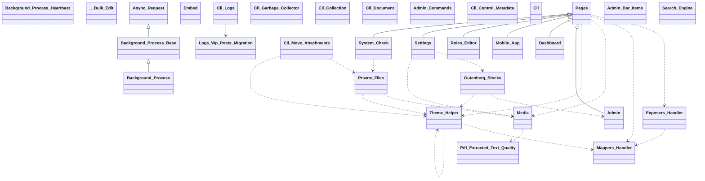
#### Classes

| Class                                                                             | Description                                                                                               |
|-----------------------------------------------------------------------------------|-----------------------------------------------------------------------------------------------------------|
| [`Async_Request`](/dev/phpdoc/classes/Tainacan/Async_Request.md)                               | Abstract base class for asynchronous requests.                                                            |
| [`Background_Process_Base`](/dev/phpdoc/classes/Tainacan/Background_Process_Base.md)           | Abstract base class for background processes in Tainacan.                                                 |
| [`Background_Process_Heartbeat`](/dev/phpdoc/classes/Tainacan/Background_Process_Heartbeat.md) |                                                                                                           |
| [`Background_Process`](/dev/phpdoc/classes/Tainacan/Background_Process.md)                     | Abstract Tainacan\Background_Process class.                                                               |
| [`Background_Exporter`](/dev/phpdoc/classes/Tainacan/Background_Exporter.md)                   | Abstract Tainacan\Background_Process class.                                                               |
| [`Exporter_Handler`](/dev/phpdoc/classes/Tainacan/Exporter_Handler.md)                         |                                                                                                           |
| [`Background_Generic_Process`](/dev/phpdoc/classes/Tainacan/Background_Generic_Process.md)     | Abstract Tainacan\Background_Process class.                                                               |
| [`Generic_Process_Handler`](/dev/phpdoc/classes/Tainacan/Generic_Process_Handler.md)           |                                                                                                           |
| [`Background_Importer`](/dev/phpdoc/classes/Tainacan/Background_Importer.md)                   | Abstract Tainacan\Background_Process class.                                                               |
| [`Importer_Handler`](/dev/phpdoc/classes/Tainacan/Importer_Handler.md)                         |                                                                                                           |
| [`__Bulk_Edit`](/dev/phpdoc/classes/Tainacan/__Bulk_Edit.md)                                   | Bulk_Edit class handles bulk item edition                                                                 |
| [`Private_Files`](/dev/phpdoc/classes/Tainacan/Private_Files.md)                               | Handles private file management for Tainacan.                                                             |
| [`Roles`](/dev/phpdoc/classes/Tainacan/Roles.md)                                               | Manages roles and capabilities for the Tainacan plugin.                                                   |
| [`Search_Engine`](/dev/phpdoc/classes/Tainacan/Search_Engine.md)                               | Implements the default Tainacan search engine.                                                            |
| [`Cli_Collection`](/dev/phpdoc/classes/Tainacan/Cli_Collection.md)                             | Handles WP-CLI commands for Tainacan collections.                                                         |
| [`Cli_Control_Metadata`](/dev/phpdoc/classes/Tainacan/Cli_Control_Metadata.md)                 | Handles WP-CLI commands for Tainacan control metadata operations.                                         |
| [`Cli_Document`](/dev/phpdoc/classes/Tainacan/Cli_Document.md)                                 | Handles WP-CLI commands for Tainacan document indexing operations.                                        |
| [`Cli_Garbage_Collector`](/dev/phpdoc/classes/Tainacan/Cli_Garbage_Collector.md)               | Handles WP-CLI commands for Tainacan garbage collection operations.                                       |
| [`Logs_Wp_Posts_Migration`](/dev/phpdoc/classes/Tainacan/Logs_Wp_Posts_Migration.md)           | Handles migration of legacy Tainacan logs from wp_posts/wp_postmeta
to the dedicated tainacan_logs table. |
| [`Cli_Logs`](/dev/phpdoc/classes/Tainacan/Cli_Logs.md)                                         | Manages Tainacan activity log data migration from the legacy wp_posts structure.                          |
| [`Cli_Move_Attachments`](/dev/phpdoc/classes/Tainacan/Cli_Move_Attachments.md)                 | Handles WP-CLI commands for Tainacan attachment migration operations.                                     |
| [`Cli`](/dev/phpdoc/classes/Tainacan/Cli.md)                                                   | Handles WP-CLI command registration for Tainacan.                                                         |
| [`Exposers_Handler`](/dev/phpdoc/classes/Tainacan/Exposers_Handler.md)                         | Load exposers classes                                                                                     |
| [`Mappers_Handler`](/dev/phpdoc/classes/Tainacan/Mappers_Handler.md)                           |                                                                                                           |
| [`Embed`](/dev/phpdoc/classes/Tainacan/Embed.md)                                               | Handles media embedding functionality for Tainacan.                                                       |
| [`Media`](/dev/phpdoc/classes/Tainacan/Media.md)                                               | Handles media functionality for Tainacan.                                                                 |
| [`Pdf_Extracted_Text_Quality`](/dev/phpdoc/classes/Tainacan/Pdf_Extracted_Text_Quality.md)     | Basic quality gate for PDF text extracted via Smalot PdfParser.                                           |
| [`Theme_Helper`](/dev/phpdoc/classes/Tainacan/Theme_Helper.md)                                 | Theme helper class for Tainacan.                                                                          |
| [`Migrations`](/dev/phpdoc/classes/Tainacan/Migrations.md)                                     |                                                                                                           |
| [`Admin`](/dev/phpdoc/classes/Tainacan/Admin.md)                                               | Pages is an abstract base class for all Tainacan admin pages.                                             |
| [`Admin_Hooks`](/dev/phpdoc/classes/Tainacan/Admin_Hooks.md)                                   |                                                                                                           |
| [`Component_Hooks`](/dev/phpdoc/classes/Tainacan/Component_Hooks.md)                           | Class Components_Hooks                                                                                    |
| [`Plugin_Hooks`](/dev/phpdoc/classes/Tainacan/Plugin_Hooks.md)                                 | Class Plugins_Hooks                                                                                       |
| [`Admin_Bar_Items`](/dev/phpdoc/classes/Tainacan/Admin_Bar_Items.md)                           | Handles WordPress admin bar items for Tainacan.                                                           |
| [`Admin_Commands`](/dev/phpdoc/classes/Tainacan/Admin_Commands.md)                             | Handles WordPress Command Palette integration for Tainacan.                                               |
| [`Pages`](/dev/phpdoc/classes/Tainacan/Pages.md)                                               | Pages is an abstract base class for all Tainacan admin pages.                                             |
| [`Dashboard`](/dev/phpdoc/classes/Tainacan/Dashboard.md)                                       | Pages is an abstract base class for all Tainacan admin pages.                                             |
| [`Gutenberg_Blocks`](/dev/phpdoc/classes/Tainacan/Gutenberg_Blocks.md)                         | Handles registration of Tainacan Gutenberg blocks and Query loop variations.                              |
| [`Mobile_App`](/dev/phpdoc/classes/Tainacan/Mobile_App.md)                                     | Pages is an abstract base class for all Tainacan admin pages.                                             |
| [`Roles_Editor`](/dev/phpdoc/classes/Tainacan/Roles_Editor.md)                                 | Pages is an abstract base class for all Tainacan admin pages.                                             |
| [`Settings`](/dev/phpdoc/classes/Tainacan/Settings.md)                                         | Pages is an abstract base class for all Tainacan admin pages.                                             |
| [`System_Check`](/dev/phpdoc/classes/Tainacan/System_Check.md)                                 | Pages is an abstract base class for all Tainacan admin pages.                                             |

### \Tainacan\API

#### Namespace Diagram

```mermaid
classDiagram
    direction TB
    class REST_Controller { }
    class endpoints_REST_Oaipmh_Expose_Controller { }
    class endpoints_REST_Roles_Controller { }
    class endpoints_REST_Metadata_Controller { }
    class endpoints_REST_Exporters_Controller { }
    class endpoints_REST_Items_Controller { }
    class endpoints_REST_Metadata_Sections_Controller { }
    class endpoints_REST_Background_Processes_Controller { }
    class endpoints_REST_Reports_Controller { }
    class endpoints_REST_Terms_Controller { }
    class endpoints_REST_Metadata_Types_Controller { }
    class endpoints_REST_Exposers_Controller { }
    class endpoints_REST_Metadatum_Mappers_Controller { }
    class endpoints_REST_Facets_Controller { }
    class endpoints_REST_Filters_Controller { }
    class endpoints_REST_Importers_Controller { }
    class endpoints_REST_Collections_Controller { }
    class endpoints_REST_Filter_Types_Controller { }
    class endpoints_REST_Item_Metadata_Controller { }
    class endpoints_REST_Bulkedit_Controller { }
    class endpoints_REST_Taxonomies_Controller { }
    class endpoints_REST_Logs_Controller { }
    class endpoints_REST_Sequence_Edit_Controller { }
    REST_Controller <|-- endpoints_REST_Background_Processes_Controller
    REST_Controller <|-- endpoints_REST_Bulkedit_Controller
    REST_Controller <|-- endpoints_REST_Collections_Controller
    REST_Controller <|-- endpoints_REST_Exporters_Controller
    REST_Controller <|-- endpoints_REST_Exposers_Controller
    REST_Controller <|-- endpoints_REST_Facets_Controller
    REST_Controller <|-- endpoints_REST_Filter_Types_Controller
    REST_Controller <|-- endpoints_REST_Filters_Controller
    REST_Controller <|-- endpoints_REST_Importers_Controller
    REST_Controller <|-- endpoints_REST_Item_Metadata_Controller
    REST_Controller <|-- endpoints_REST_Items_Controller
    REST_Controller <|-- endpoints_REST_Logs_Controller
    REST_Controller <|-- endpoints_REST_Metadata_Controller
    REST_Controller <|-- endpoints_REST_Metadata_Sections_Controller
    REST_Controller <|-- endpoints_REST_Metadata_Types_Controller
    REST_Controller <|-- endpoints_REST_Metadatum_Mappers_Controller
    REST_Controller <|-- endpoints_REST_Oaipmh_Expose_Controller
    REST_Controller <|-- endpoints_REST_Reports_Controller
    REST_Controller <|-- endpoints_REST_Roles_Controller
    REST_Controller <|-- endpoints_REST_Sequence_Edit_Controller
    REST_Controller <|-- endpoints_REST_Taxonomies_Controller
    REST_Controller <|-- endpoints_REST_Terms_Controller
```
#### Classes

| Class                                                       | Description                                            |
|-------------------------------------------------------------|--------------------------------------------------------|
| [`REST_Controller`](/dev/phpdoc/classes/Tainacan/API/REST_Controller.md) | Abstract base class for Tainacan REST API controllers. |

### \Tainacan\API\EndPoints

#### Namespace Diagram

#### Classes

| Class                                                                                                           | Description                                                         |
|-----------------------------------------------------------------------------------------------------------------|---------------------------------------------------------------------|
| [`REST_Background_Processes_Controller`](/dev/phpdoc/classes/Tainacan/API/EndPoints/REST_Background_Processes_Controller.md) | REST API controller for managing Tainacan background processes.     |
| [`REST_Bulkedit_Controller`](/dev/phpdoc/classes/Tainacan/API/EndPoints/REST_Bulkedit_Controller.md)                         | REST API controller for managing Tainacan bulk edit operations.     |
| [`REST_Collections_Controller`](/dev/phpdoc/classes/Tainacan/API/EndPoints/REST_Collections_Controller.md)                   | REST API controller for managing Tainacan collections.              |
| [`REST_Exporters_Controller`](/dev/phpdoc/classes/Tainacan/API/EndPoints/REST_Exporters_Controller.md)                       | REST API controller for managing Tainacan exporters.                |
| [`REST_Exposers_Controller`](/dev/phpdoc/classes/Tainacan/API/EndPoints/REST_Exposers_Controller.md)                         | REST API controller for managing Tainacan exposers.                 |
| [`REST_Facets_Controller`](/dev/phpdoc/classes/Tainacan/API/EndPoints/REST_Facets_Controller.md)                             | REST API controller for managing Tainacan facets.                   |
| [`REST_Filter_Types_Controller`](/dev/phpdoc/classes/Tainacan/API/EndPoints/REST_Filter_Types_Controller.md)                 | REST API controller for managing Tainacan filter types.             |
| [`REST_Filters_Controller`](/dev/phpdoc/classes/Tainacan/API/EndPoints/REST_Filters_Controller.md)                           | REST API controller for managing Tainacan filters.                  |
| [`REST_Importers_Controller`](/dev/phpdoc/classes/Tainacan/API/EndPoints/REST_Importers_Controller.md)                       | REST API controller for managing Tainacan importers.                |
| [`REST_Item_Metadata_Controller`](/dev/phpdoc/classes/Tainacan/API/EndPoints/REST_Item_Metadata_Controller.md)               | REST API controller for managing Tainacan item metadata.            |
| [`REST_Items_Controller`](/dev/phpdoc/classes/Tainacan/API/EndPoints/REST_Items_Controller.md)                               | REST API controller for managing Tainacan items.                    |
| [`REST_Logs_Controller`](/dev/phpdoc/classes/Tainacan/API/EndPoints/REST_Logs_Controller.md)                                 | REST API controller for managing Tainacan logs.                     |
| [`REST_Metadata_Controller`](/dev/phpdoc/classes/Tainacan/API/EndPoints/REST_Metadata_Controller.md)                         | REST API controller for managing Tainacan metadata.                 |
| [`REST_Metadata_Sections_Controller`](/dev/phpdoc/classes/Tainacan/API/EndPoints/REST_Metadata_Sections_Controller.md)       | REST API controller for managing Tainacan metadata sections.        |
| [`REST_Metadata_Types_Controller`](/dev/phpdoc/classes/Tainacan/API/EndPoints/REST_Metadata_Types_Controller.md)             | REST API controller for managing Tainacan metadata types.           |
| [`REST_Metadatum_Mappers_Controller`](/dev/phpdoc/classes/Tainacan/API/EndPoints/REST_Metadatum_Mappers_Controller.md)       | REST API controller for managing Tainacan metadatum mappers.        |
| [`REST_Oaipmh_Expose_Controller`](/dev/phpdoc/classes/Tainacan/API/EndPoints/REST_Oaipmh_Expose_Controller.md)               | REST API controller for managing Tainacan OAI-PMH exposure.         |
| [`REST_Reports_Controller`](/dev/phpdoc/classes/Tainacan/API/EndPoints/REST_Reports_Controller.md)                           | REST API controller for managing Tainacan reports.                  |
| [`REST_Roles_Controller`](/dev/phpdoc/classes/Tainacan/API/EndPoints/REST_Roles_Controller.md)                               | REST API controller for managing Tainacan roles and capabilities.   |
| [`REST_Sequence_Edit_Controller`](/dev/phpdoc/classes/Tainacan/API/EndPoints/REST_Sequence_Edit_Controller.md)               | REST API controller for managing Tainacan sequence edit operations. |
| [`REST_Taxonomies_Controller`](/dev/phpdoc/classes/Tainacan/API/EndPoints/REST_Taxonomies_Controller.md)                     | REST API controller for managing Tainacan taxonomies.               |
| [`REST_Terms_Controller`](/dev/phpdoc/classes/Tainacan/API/EndPoints/REST_Terms_Controller.md)                               | REST API controller for managing Tainacan taxonomy terms.           |

### \Tainacan\Entities

#### Namespace Diagram

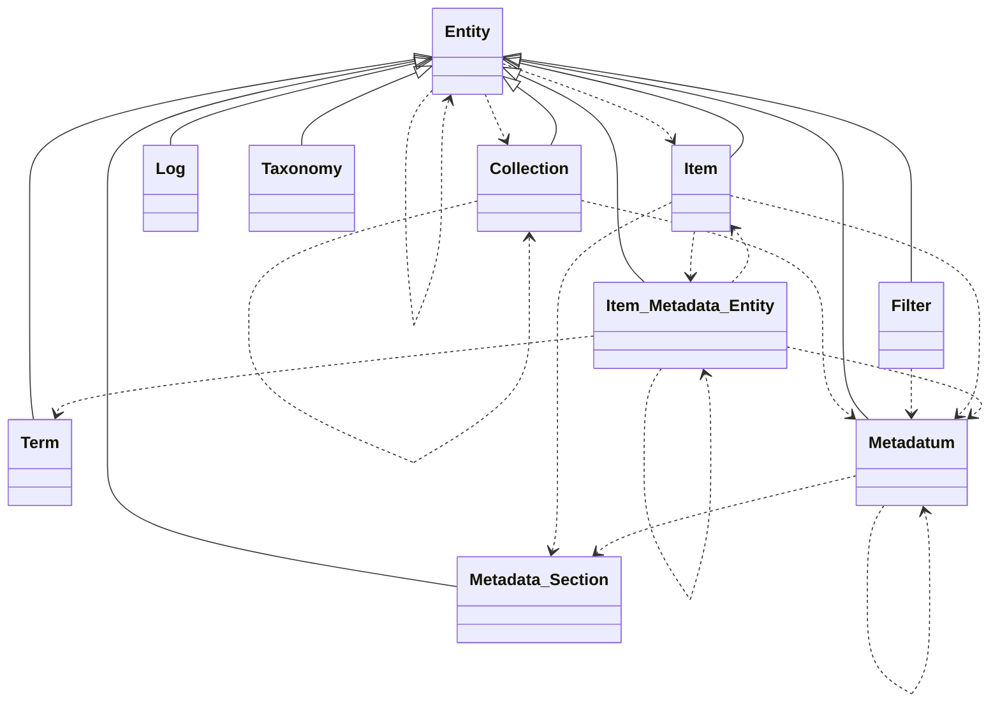
#### Classes

| Class                                                                      | Description                                    |
|----------------------------------------------------------------------------|------------------------------------------------|
| [`Collection`](/dev/phpdoc/classes/Tainacan/Entities/Collection.md)                     | Represents a Tainacan Collection entity.       |
| [`Entity`](/dev/phpdoc/classes/Tainacan/Entities/Entity.md)                             | Abstract base class for all Tainacan entities. |
| [`Filter`](/dev/phpdoc/classes/Tainacan/Entities/Filter.md)                             | Represents a Tainacan Filter entity.           |
| [`Item_Metadata_Entity`](/dev/phpdoc/classes/Tainacan/Entities/Item_Metadata_Entity.md) | Represents a Tainacan Item Metadata Entity.    |
| [`Item`](/dev/phpdoc/classes/Tainacan/Entities/Item.md)                                 | Represents a Tainacan Item entity.             |
| [`Log`](/dev/phpdoc/classes/Tainacan/Entities/Log.md)                                   | Represents a Tainacan Log entity.              |
| [`Metadata_Section`](/dev/phpdoc/classes/Tainacan/Entities/Metadata_Section.md)         | Represents a Tainacan Metadata Section entity. |
| [`Metadatum`](/dev/phpdoc/classes/Tainacan/Entities/Metadatum.md)                       | Represents a Tainacan Metadatum entity.        |
| [`Taxonomy`](/dev/phpdoc/classes/Tainacan/Entities/Taxonomy.md)                         | Represents a Tainacan Taxonomy entity.         |
| [`Term`](/dev/phpdoc/classes/Tainacan/Entities/Term.md)                                 | Represents a Tainacan Term entity.             |

### \Tainacan\Exporter

#### Namespace Diagram

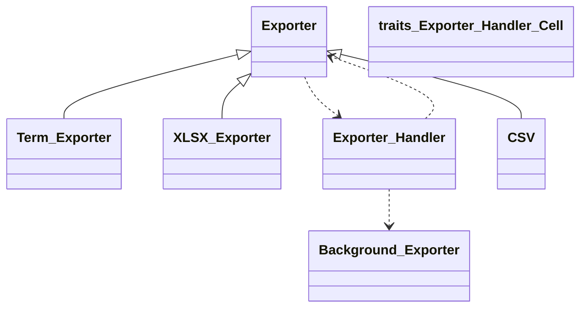
#### Classes

| Class                                                        | Description |
|--------------------------------------------------------------|-------------|
| [`CSV`](/dev/phpdoc/classes/Tainacan/Exporter/CSV.md)                     |             |
| [`Exporter`](/dev/phpdoc/classes/Tainacan/Exporter/Exporter.md)           |             |
| [`Term_Exporter`](/dev/phpdoc/classes/Tainacan/Exporter/Term_Exporter.md) |             |
| [`XLSX_Exporter`](/dev/phpdoc/classes/Tainacan/Exporter/XLSX_Exporter.md) |             |

### \Tainacan\Exposers

#### Namespace Diagram

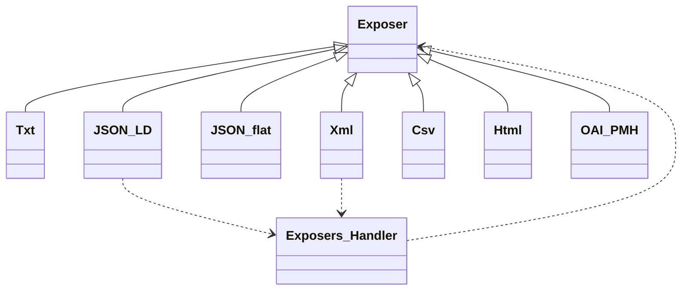
#### Classes

| Class                                                | Description                                 |
|------------------------------------------------------|---------------------------------------------|
| [`Csv`](/dev/phpdoc/classes/Tainacan/Exposers/Csv.md)             | Generate a Csv formated response            |
| [`Exposer`](/dev/phpdoc/classes/Tainacan/Exposers/Exposer.md)     | abstract class for implement exposer types  |
| [`Html`](/dev/phpdoc/classes/Tainacan/Exposers/Html.md)           | Generate a Html formated response           |
| [`JSON_flat`](/dev/phpdoc/classes/Tainacan/Exposers/JSON_flat.md) | Generate a text formated response           |
| [`JSON_LD`](/dev/phpdoc/classes/Tainacan/Exposers/JSON_LD.md)     | Generate a text formated response           |
| [`OAI_PMH`](/dev/phpdoc/classes/Tainacan/Exposers/OAI_PMH.md)     | Generate a OAI_PMH/oai_dc formated response |
| [`Txt`](/dev/phpdoc/classes/Tainacan/Exposers/Txt.md)             | Generate a text formated response           |
| [`Xml`](/dev/phpdoc/classes/Tainacan/Exposers/Xml.md)             | Generate a Csv formated response            |

### \Tainacan\Filter_Types

#### Classes

| Class                                                                                                            | Description              |
|------------------------------------------------------------------------------------------------------------------|--------------------------|
| [`Autocomplete`](/dev/phpdoc/classes/Tainacan/Filter_Types/Autocomplete.md)                                                   | Class TainacanFilterType |
| [`Checkbox`](/dev/phpdoc/classes/Tainacan/Filter_Types/Checkbox.md)                                                           | Class TainacanFilterType |
| [`Date`](/dev/phpdoc/classes/Tainacan/Filter_Types/Date.md)                                                                   | Class TainacanFilterType |
| [`Date_Helper`](/dev/phpdoc/classes/Tainacan/Filter_Types/Date_Helper.md)                                                     |                          |
| [`Date_Interval`](/dev/phpdoc/classes/Tainacan/Filter_Types/Date_Interval.md)                                                 | Class TainacanFilterType |
| [`Date_Interval_Interval_Helper`](/dev/phpdoc/classes/Tainacan/Filter_Types/Date_Interval_Interval_Helper.md)                 |                          |
| [`Dates_Intersection`](/dev/phpdoc/classes/Tainacan/Filter_Types/Dates_Intersection.md)                                       | Class TainacanFilterType |
| [`Dates_Intersection_Interval_Helper`](/dev/phpdoc/classes/Tainacan/Filter_Types/Dates_Intersection_Interval_Helper.md)       |                          |
| [`Filter_Type`](/dev/phpdoc/classes/Tainacan/Filter_Types/Filter_Type.md)                                                     | Class TainacanFilterType |
| [`Filter_Type_Helper`](/dev/phpdoc/classes/Tainacan/Filter_Types/Filter_Type_Helper.md)                                       | Class FilterTypeHelper   |
| [`Numeric`](/dev/phpdoc/classes/Tainacan/Filter_Types/Numeric.md)                                                             | Class TainacanFilterType |
| [`Numeric_Helper`](/dev/phpdoc/classes/Tainacan/Filter_Types/Numeric_Helper.md)                                               |                          |
| [`Numeric_Interval`](/dev/phpdoc/classes/Tainacan/Filter_Types/Numeric_Interval.md)                                           | Class TainacanFilterType |
| [`Numeric_Interval_Interval_Helper`](/dev/phpdoc/classes/Tainacan/Filter_Types/Numeric_Interval_Interval_Helper.md)           |                          |
| [`Numeric_List_Interval_Helper`](/dev/phpdoc/classes/Tainacan/Filter_Types/Numeric_List_Interval_Helper.md)                   |                          |
| [`Numeric_List_Interval`](/dev/phpdoc/classes/Tainacan/Filter_Types/Numeric_List_Interval.md)                                 | Class TainacanFilterType |
| [`Numerics_Intersection`](/dev/phpdoc/classes/Tainacan/Filter_Types/Numerics_Intersection.md)                                 | Class TainacanFilterType |
| [`Numerics_Intersection_Interval_Helper`](/dev/phpdoc/classes/Tainacan/Filter_Types/Numerics_Intersection_Interval_Helper.md) |                          |
| [`Selectbox`](/dev/phpdoc/classes/Tainacan/Filter_Types/Selectbox.md)                                                         | Class TainacanFilterType |
| [`Taginput`](/dev/phpdoc/classes/Tainacan/Filter_Types/Taginput.md)                                                           | Class TainacanFilterType |
| [`TaxonomyCheckbox`](/dev/phpdoc/classes/Tainacan/Filter_Types/TaxonomyCheckbox.md)                                           | Class TainacanFilterType |
| [`TaxonomySelectbox`](/dev/phpdoc/classes/Tainacan/Filter_Types/TaxonomySelectbox.md)                                         | Class TaxonomySelectbox  |
| [`TaxonomyTaginput`](/dev/phpdoc/classes/Tainacan/Filter_Types/TaxonomyTaginput.md)                                           | Class Taginput           |

### \Tainacan\GenericProcess

#### Namespace Diagram

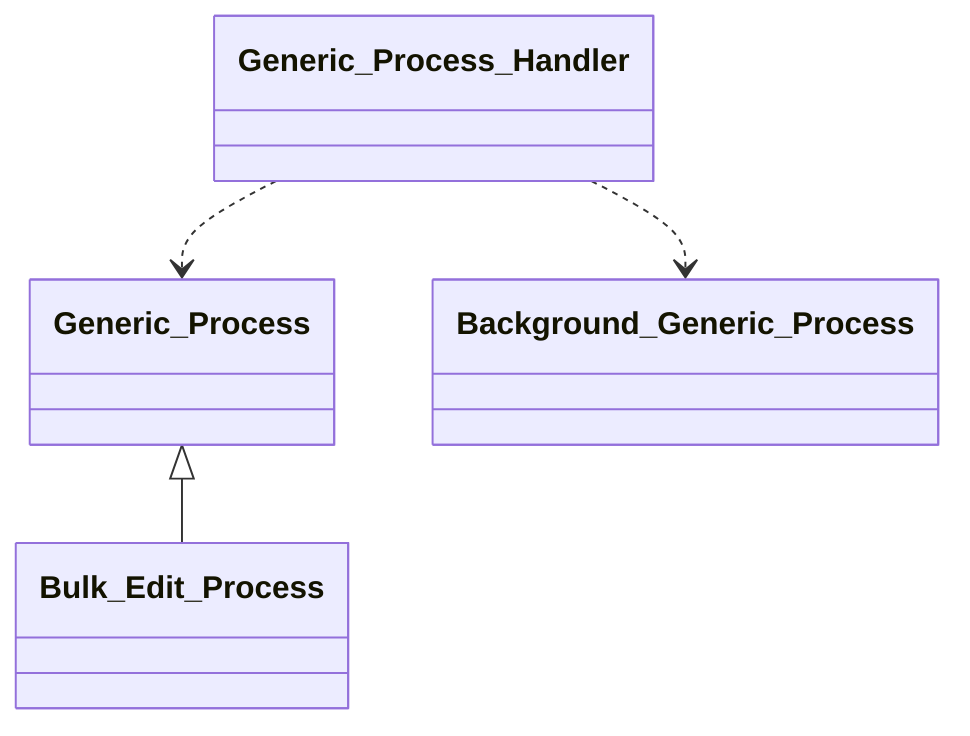
#### Classes

| Class                                                                      | Description |
|----------------------------------------------------------------------------|-------------|
| [`Bulk_Edit_Process`](/dev/phpdoc/classes/Tainacan/GenericProcess/Bulk_Edit_Process.md) |             |
| [`Generic_Process`](/dev/phpdoc/classes/Tainacan/GenericProcess/Generic_Process.md)     |             |

### \Tainacan\Importer

#### Namespace Diagram

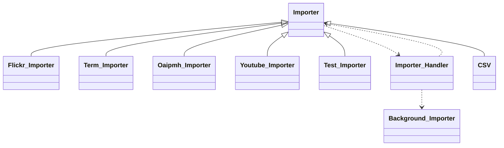
#### Classes

| Class                                                              | Description   |
|--------------------------------------------------------------------|---------------|
| [`CSV`](/dev/phpdoc/classes/Tainacan/Importer/CSV.md)                           |               |
| [`Flickr_Importer`](/dev/phpdoc/classes/Tainacan/Importer/Flickr_Importer.md)   |               |
| [`Importer`](/dev/phpdoc/classes/Tainacan/Importer/Importer.md)                 |               |
| [`Oaipmh_Importer`](/dev/phpdoc/classes/Tainacan/Importer/Oaipmh_Importer.md)   |               |
| [`Term_Importer`](/dev/phpdoc/classes/Tainacan/Importer/Term_Importer.md)       |               |
| [`Test_Importer`](/dev/phpdoc/classes/Tainacan/Importer/Test_Importer.md)       | Test Importer |
| [`Youtube_Importer`](/dev/phpdoc/classes/Tainacan/Importer/Youtube_Importer.md) |               |

### \Tainacan\Integrations

#### Namespace Diagram

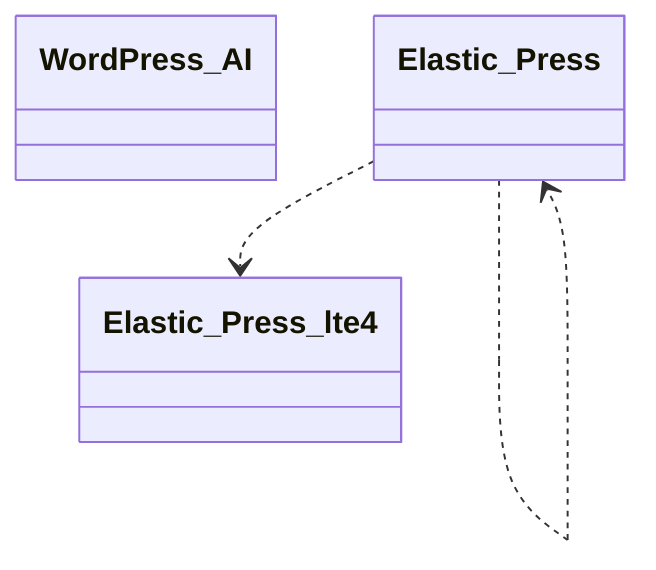
#### Classes

| Class                                                                      | Description                                                                 |
|----------------------------------------------------------------------------|-----------------------------------------------------------------------------|
| [`Elastic_Press_lte4`](/dev/phpdoc/classes/Tainacan/Integrations/Elastic_Press_lte4.md) |                                                                             |
| [`Elastic_Press`](/dev/phpdoc/classes/Tainacan/Integrations/Elastic_Press.md)           | Class Elastic_Press                                                         |
| [`WordPress_AI`](/dev/phpdoc/classes/Tainacan/Integrations/WordPress_AI.md)             | Integration with the WordPress AI plugin (https://github.com/WordPress/ai). |

### \Tainacan\Mappers

#### Namespace Diagram

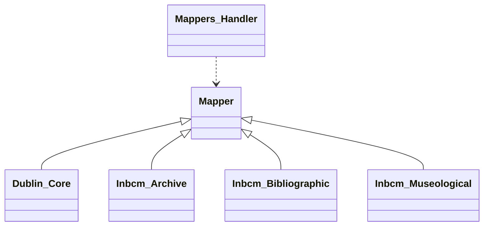
#### Classes

| Class                                                                   | Description                                                  |
|-------------------------------------------------------------------------|--------------------------------------------------------------|
| [`Dublin_Core`](/dev/phpdoc/classes/Tainacan/Mappers/Dublin_Core.md)                 | Support Dublin Core Mapping
http://purl.org/dc/elements/1.1/ |
| [`Inbcm_Archive`](/dev/phpdoc/classes/Tainacan/Mappers/Inbcm_Archive.md)             |                                                              |
| [`Inbcm_Bibliographic`](/dev/phpdoc/classes/Tainacan/Mappers/Inbcm_Bibliographic.md) |                                                              |
| [`Inbcm_Museological`](/dev/phpdoc/classes/Tainacan/Mappers/Inbcm_Museological.md)   |                                                              |
| [`Mapper`](/dev/phpdoc/classes/Tainacan/Mappers/Mapper.md)                           |                                                              |

### \Tainacan\Metadata_Types

#### Classes

| Class                                                                                      | Description                 |
|--------------------------------------------------------------------------------------------|-----------------------------|
| [`Compound`](/dev/phpdoc/classes/Tainacan/Metadata_Types/Compound.md)                                   | Class TainacanMetadatumType |
| [`MetadataTypeControlHelper`](/dev/phpdoc/classes/Tainacan/Metadata_Types/MetadataTypeControlHelper.md) |                             |
| [`Control`](/dev/phpdoc/classes/Tainacan/Metadata_Types/Control.md)                                     | Class TainacanMetadatumType |
| [`Core_Description`](/dev/phpdoc/classes/Tainacan/Metadata_Types/Core_Description.md)                   | Class TainacanMetadatumType |
| [`Core_Title`](/dev/phpdoc/classes/Tainacan/Metadata_Types/Core_Title.md)                               | Class TainacanMetadatumType |
| [`Date`](/dev/phpdoc/classes/Tainacan/Metadata_Types/Date.md)                                           | Class TainacanMetadatumType |
| [`GeoCoordinate`](/dev/phpdoc/classes/Tainacan/Metadata_Types/GeoCoordinate.md)                         | Class GeoCoordinate         |
| [`Metadata_Type`](/dev/phpdoc/classes/Tainacan/Metadata_Types/Metadata_Type.md)                         | Class TainacanMetadatumType |
| [`Metadata_Type_Helper`](/dev/phpdoc/classes/Tainacan/Metadata_Types/Metadata_Type_Helper.md)           | Class MetadataTypeHelper    |
| [`Numeric`](/dev/phpdoc/classes/Tainacan/Metadata_Types/Numeric.md)                                     | Class TainacanMetadatumType |
| [`Relationship`](/dev/phpdoc/classes/Tainacan/Metadata_Types/Relationship.md)                           | Class TainacanMetadatumType |
| [`Selectbox`](/dev/phpdoc/classes/Tainacan/Metadata_Types/Selectbox.md)                                 | Class TainacanMetadatumType |
| [`Taxonomy`](/dev/phpdoc/classes/Tainacan/Metadata_Types/Taxonomy.md)                                   | Class TainacanMetadatumType |
| [`Text`](/dev/phpdoc/classes/Tainacan/Metadata_Types/Text.md)                                           | Class TainacanMetadatumType |
| [`Textarea`](/dev/phpdoc/classes/Tainacan/Metadata_Types/Textarea.md)                                   | Class TainacanMetadatumType |
| [`URL`](/dev/phpdoc/classes/Tainacan/Metadata_Types/URL.md)                                             | Class TainacanMetadatumType |
| [`User`](/dev/phpdoc/classes/Tainacan/Metadata_Types/User.md)                                           | Class TainacanMetadatumType |

### \Tainacan\OAIPMHExpose

#### Namespace Diagram

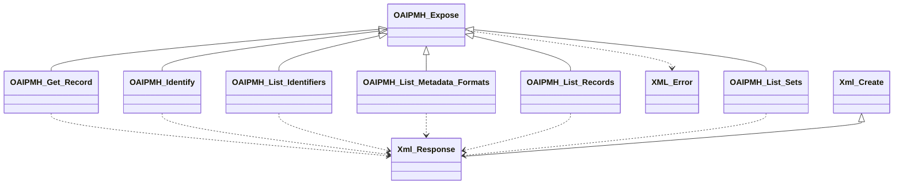
#### Classes

| Class                                                                                          | Description                                                   |
|------------------------------------------------------------------------------------------------|---------------------------------------------------------------|
| [`OAIPMH_Expose`](/dev/phpdoc/classes/Tainacan/OAIPMHExpose/OAIPMH_Expose.md)                               | Support Dublin Core Mapping
http://purl.org/dc/elements/1.1/  |
| [`OAIPMH_Get_Record`](/dev/phpdoc/classes/Tainacan/OAIPMHExpose/OAIPMH_Get_Record.md)                       | Support Dublin Core Mapping
http://purl.org/dc/elements/1.1/  |
| [`OAIPMH_Identify`](/dev/phpdoc/classes/Tainacan/OAIPMHExpose/OAIPMH_Identify.md)                           | Support Dublin Core Mapping
http://purl.org/dc/elements/1.1/  |
| [`OAIPMH_List_Identifiers`](/dev/phpdoc/classes/Tainacan/OAIPMHExpose/OAIPMH_List_Identifiers.md)           | Support Dublin Core Mapping
http://purl.org/dc/elements/1.1/  |
| [`OAIPMH_List_Metadata_Formats`](/dev/phpdoc/classes/Tainacan/OAIPMHExpose/OAIPMH_List_Metadata_Formats.md) | Support Dublin Core Mapping
http://purl.org/dc/elements/1.1/  |
| [`OAIPMH_List_Records`](/dev/phpdoc/classes/Tainacan/OAIPMHExpose/OAIPMH_List_Records.md)                   | Support Dublin Core Mapping
http://purl.org/dc/elements/1.1/  |
| [`OAIPMH_List_Sets`](/dev/phpdoc/classes/Tainacan/OAIPMHExpose/OAIPMH_List_Sets.md)                         | Support Dublin Core Mapping
http://purl.org/dc/elements/1.1/  |
| [`Xml_Create`](/dev/phpdoc/classes/Tainacan/OAIPMHExpose/Xml_Create.md)                                     | A wraper of DOMDocument for data provider                     |
| [`XML_Error`](/dev/phpdoc/classes/Tainacan/OAIPMHExpose/XML_Error.md)                                       | Generate an XML response when a request cannot be finished    |
| [`Xml_Response`](/dev/phpdoc/classes/Tainacan/OAIPMHExpose/Xml_Response.md)                                 | Generate an XML response to a request if no error has occured |

### \Tainacan\Repositories

#### Namespace Diagram

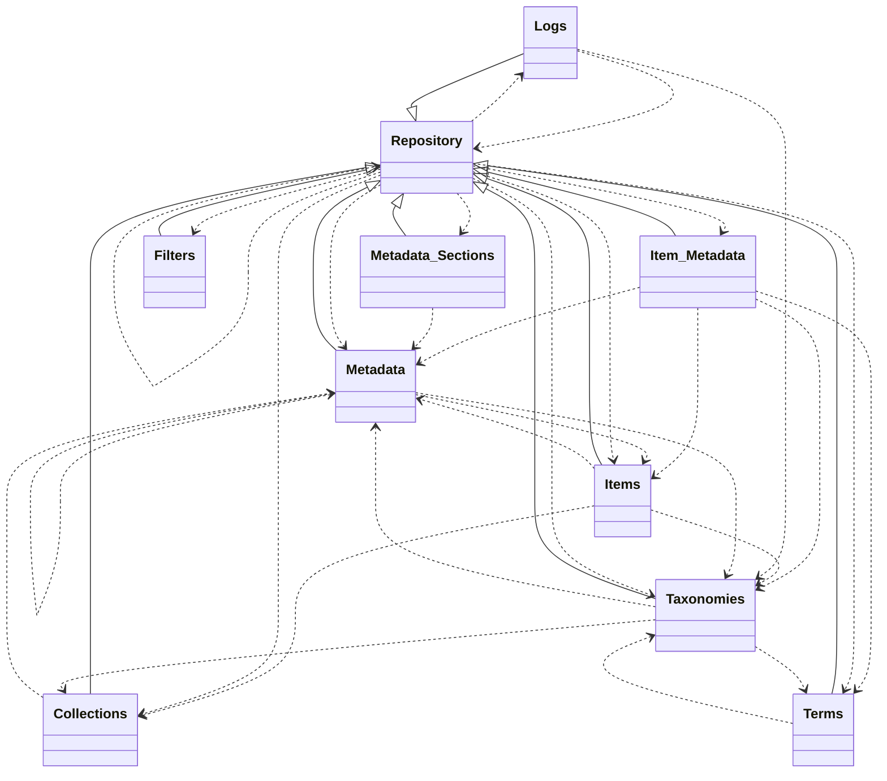
#### Classes

| Class                                                                    | Description                                            |
|--------------------------------------------------------------------------|--------------------------------------------------------|
| [`Collections`](/dev/phpdoc/classes/Tainacan/Repositories/Collections.md)             | Repository for managing Tainacan collections.          |
| [`Filters`](/dev/phpdoc/classes/Tainacan/Repositories/Filters.md)                     | Repository for managing Tainacan filters.              |
| [`Item_Metadata`](/dev/phpdoc/classes/Tainacan/Repositories/Item_Metadata.md)         | Repository for managing Tainacan item metadata.        |
| [`Items`](/dev/phpdoc/classes/Tainacan/Repositories/Items.md)                         | Repository for managing Tainacan items.                |
| [`Logs`](/dev/phpdoc/classes/Tainacan/Repositories/Logs.md)                           | Abstract base class for all Tainacan repositories.     |
| [`Logs`](/dev/phpdoc/classes/Tainacan/Repositories/Logs.md)                           | Repository for managing Tainacan logs.                 |
| [`Metadata_Sections`](/dev/phpdoc/classes/Tainacan/Repositories/Metadata_Sections.md) | Repository for managing Tainacan metadata sections.    |
| [`Metadata`](/dev/phpdoc/classes/Tainacan/Repositories/Metadata.md)                   | Repository for managing Tainacan metadata definitions. |
| [`Repository`](/dev/phpdoc/classes/Tainacan/Repositories/Repository.md)               | Abstract base class for all Tainacan repositories.     |
| [`Taxonomies`](/dev/phpdoc/classes/Tainacan/Repositories/Taxonomies.md)               | Repository for managing Tainacan taxonomies.           |
| [`Terms`](/dev/phpdoc/classes/Tainacan/Repositories/Terms.md)                         | Repository for managing Tainacan taxonomy terms.       |

### \Tainacan\Traits

#### Namespace Diagram

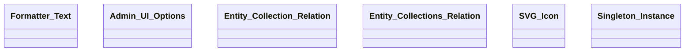
#### Traits

| Trait                                                                                  | Description                                                                                                                                                                                      |
|----------------------------------------------------------------------------------------|--------------------------------------------------------------------------------------------------------------------------------------------------------------------------------------------------|
| [`Exporter_Handler_Cell`](/dev/phpdoc/classes/Tainacan/Traits/Exporter_Handler_Cell.md)             |                                                                                                                                                                                                  |
| [`Admin_UI_Options`](/dev/phpdoc/classes/Tainacan/Traits/Admin_UI_Options.md)                       | Class for getting Admin UI options passed either via query string in
the URL or via the 'tainacan-admin-ui-options' filter.                                                                      |
| [`Entity_Collection_Relation`](/dev/phpdoc/classes/Tainacan/Traits/Entity_Collection_Relation.md)   | Defines Collection and Items relation                                                                                                                                                            |
| [`Entity_Collections_Relation`](/dev/phpdoc/classes/Tainacan/Traits/Entity_Collections_Relation.md) |                                                                                                                                                                                                  |
| [`Formatter_Text`](/dev/phpdoc/classes/Tainacan/Traits/Formatter_Text.md)                           | Class for formatter texts                                                                                                                                                                        |
| [`Singleton_Instance`](/dev/phpdoc/classes/Tainacan/Traits/Singleton_Instance.md)                   | Class for Singleton pattern                                                                                                                                                                      |
| [`SVG_Icon`](/dev/phpdoc/classes/Tainacan/Traits/SVG_Icon.md)                                       | Class for getting inline svg icons based on the Tainacan Icon font and new symbols needed
The svg files have a fill of currentColor and width and height of 1em to allow external customization. |
