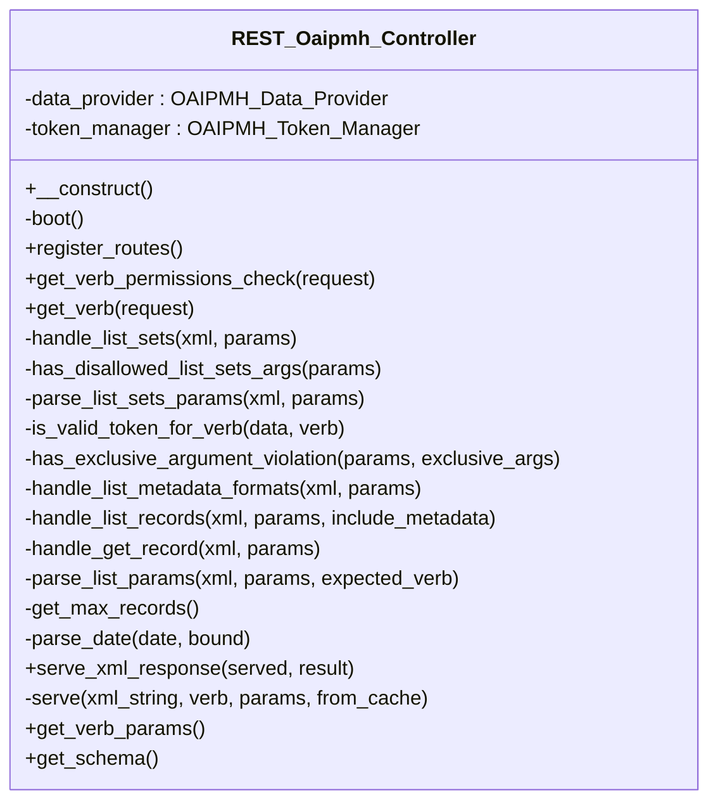

# REST_Oaipmh_Controller

REST controller exposing the repository as an OAI-PMH 2.0 data provider.

Implements the six OAI-PMH verbs at /wp-json/tainacan/v2/oai. The response is
raw OAI-PMH XML, served through rest_pre_serve_request so harvesters receive
a valid document instead of a JSON envelope.

***

* Full name: `\Tainacan\API\EndPoints\REST_Oaipmh_Controller`
* Parent class: [`\Tainacan\API\REST_Controller`](../REST_Controller)

## Class Diagram



## Properties

### data_provider

```php
private \Tainacan\OAIPMH\OAIPMH_Data_Provider $data_provider
```

***

### token_manager

```php
private \Tainacan\OAIPMH\OAIPMH_Token_Manager $token_manager
```

***

## Methods

### __construct

Constructor for the REST_Controller class.

```php
public __construct(): mixed
```

Sets up the namespace and registers routes and filters.

***

### boot

Lazily build the provider collaborators (after post types are registered).

```php
private boot(): mixed
```

***

### register_routes

```php
public register_routes(): mixed
```

***

### get_verb_permissions_check

```php
public get_verb_permissions_check(\WP_REST_Request $request): bool|\WP_Error
```

**Parameters:**

| Parameter  | Type                 | Description |
|------------|----------------------|-------------|
| `$request` | **\WP_REST_Request** |             |

***

### get_verb

Dispatch the requested OAI-PMH verb and return the XML response.

```php
public get_verb(\WP_REST_Request $request): \WP_REST_Response
```

**Parameters:**

| Parameter  | Type                 | Description |
|------------|----------------------|-------------|
| `$request` | **\WP_REST_Request** |             |

***

### handle_list_sets

```php
private handle_list_sets(\Tainacan\OAIPMH\OAIPMH_Xml_Generator $xml, array $params): mixed
```

**Parameters:**

| Parameter | Type                                      | Description |
|-----------|-------------------------------------------|-------------|
| `$xml`    | **\Tainacan\OAIPMH\OAIPMH_Xml_Generator** |             |
| `$params` | **array**                                 |             |

***

### has_disallowed_list_sets_args

ListSets accepts only verb and resumptionToken.

```php
private has_disallowed_list_sets_args(array $params): bool
```

**Parameters:**

| Parameter | Type      | Description |
|-----------|-----------|-------------|
| `$params` | **array** |             |

***

### parse_list_sets_params

```php
private parse_list_sets_params(\Tainacan\OAIPMH\OAIPMH_Xml_Generator $xml, array $params): array|false
```

**Parameters:**

| Parameter | Type                                      | Description |
|-----------|-------------------------------------------|-------------|
| `$xml`    | **\Tainacan\OAIPMH\OAIPMH_Xml_Generator** |             |
| `$params` | **array**                                 |             |

***

### is_valid_token_for_verb

```php
private is_valid_token_for_verb(array $data, string $verb): bool
```

**Parameters:**

| Parameter | Type       | Description |
|-----------|------------|-------------|
| `$data`   | **array**  |             |
| `$verb`   | **string** |             |

***

### has_exclusive_argument_violation

```php
private has_exclusive_argument_violation(array $params, array $exclusive_args): bool
```

**Parameters:**

| Parameter         | Type      | Description |
|-------------------|-----------|-------------|
| `$params`         | **array** |             |
| `$exclusive_args` | **array** |             |

***

### handle_list_metadata_formats

```php
private handle_list_metadata_formats(\Tainacan\OAIPMH\OAIPMH_Xml_Generator $xml, array $params): mixed
```

**Parameters:**

| Parameter | Type                                      | Description |
|-----------|-------------------------------------------|-------------|
| `$xml`    | **\Tainacan\OAIPMH\OAIPMH_Xml_Generator** |             |
| `$params` | **array**                                 |             |

***

### handle_list_records

```php
private handle_list_records(\Tainacan\OAIPMH\OAIPMH_Xml_Generator $xml, array $params, bool $include_metadata): mixed
```

**Parameters:**

| Parameter           | Type                                      | Description |
|---------------------|-------------------------------------------|-------------|
| `$xml`              | **\Tainacan\OAIPMH\OAIPMH_Xml_Generator** |             |
| `$params`           | **array**                                 |             |
| `$include_metadata` | **bool**                                  |             |

***

### handle_get_record

```php
private handle_get_record(\Tainacan\OAIPMH\OAIPMH_Xml_Generator $xml, array $params): mixed
```

**Parameters:**

| Parameter | Type                                      | Description |
|-----------|-------------------------------------------|-------------|
| `$xml`    | **\Tainacan\OAIPMH\OAIPMH_Xml_Generator** |             |
| `$params` | **array**                                 |             |

***

### parse_list_params

Resolve the pagination query from the request or a resumptionToken.

```php
private parse_list_params(\Tainacan\OAIPMH\OAIPMH_Xml_Generator $xml, array $params, mixed $expected_verb): array|false
```

**Parameters:**

| Parameter        | Type                                      | Description |
|------------------|-------------------------------------------|-------------|
| `$xml`           | **\Tainacan\OAIPMH\OAIPMH_Xml_Generator** |             |
| `$params`        | **array**                                 |             |
| `$expected_verb` | **mixed**                                 |             |

***

### get_max_records

Page size for paginated OAI list verbs.

```php
private get_max_records(): int
```

Defaults to the same value as the REST API and theme search
(`tainacan_option_search_results_per_page`, via $TAINACAN_API_MAX_ITEMS_PER_PAGE).

***

### parse_date

Normalize an OAI date argument (YYYY-MM-DD or full UTC) to SQL form.

```php
private parse_date(string $date, string $bound = 'from'): string|null
```

**Parameters:**

| Parameter | Type       | Description               |
|-----------|------------|---------------------------|
| `$date`   | **string** |                           |
| `$bound`  | **string** | Either 'from' or 'until'. |

***

### serve_xml_response

Echo raw OAI-PMH XML instead of the REST JSON envelope.

```php
public serve_xml_response(bool $served, \WP_REST_Response $result): bool
```

**Parameters:**

| Parameter | Type                  | Description                             |
|-----------|-----------------------|-----------------------------------------|
| `$served` | **bool**              | Whether the request was already served. |
| `$result` | **\WP_REST_Response** | REST response object.                   |

***

### serve

Serve an XML string as the raw response body.

```php
private serve(string $xml_string, string $verb = '', array $params = array(), bool $from_cache = false): \WP_REST_Response
```

**Parameters:**

| Parameter     | Type       | Description                                                |
|---------------|------------|------------------------------------------------------------|
| `$xml_string` | **string** | The OAI-PMH XML document.                                  |
| `$verb`       | **string** | The requested verb.                                        |
| `$params`     | **array**  | The request parameters.                                    |
| `$from_cache` | **bool**   | Whether the body came from a short-circuit (cache) filter. |

***

### get_verb_params

```php
public get_verb_params(): mixed
```

***

### get_schema

```php
public get_schema(): mixed
```

***

## Inherited methods

### __construct

Constructor for the REST_Controller class.

```php
public __construct(): mixed
```

Sets up the namespace and registers routes and filters.

***

### filter_object_by_attributes

Filters an object by specified attributes.

```php
protected filter_object_by_attributes(mixed $object, string|array $attributes): array
```

**Parameters:**

| Parameter     | Type              | Description                                       |
|---------------|-------------------|---------------------------------------------------|
| `$object`     | **mixed**         | The object to filter.                             |
| `$attributes` | **string\|array** | The attributes to include in the filtered result. |

**Return Value:**

Filtered object data.

***

### prepare_item_for_updating

Prepares an item for updating with new values.

```php
protected prepare_item_for_updating(mixed $object, array $new_values): \Tainacan\Entities\Entity
```

**Parameters:**

| Parameter     | Type      | Description                      |
|---------------|-----------|----------------------------------|
| `$object`     | **mixed** | The object to update.            |
| `$new_values` | **array** | New values to set on the object. |

**Return Value:**

The updated entity.

***

### prepare_filters

```php
protected prepare_filters(mixed $request): array
```

**Parameters:**

| Parameter  | Type      | Description |
|------------|-----------|-------------|
| `$request` | **mixed** |             |

**Throws:**

- [`Exception`](../../../Exception)

***

### add_support_to_tax_query_like

```php
public add_support_to_tax_query_like(mixed $args): mixed
```

**Parameters:**

| Parameter | Type      | Description |
|-----------|-----------|-------------|
| `$args`   | **mixed** |             |

***

### sanitize_value

```php
protected sanitize_value(mixed $value): mixed
```

**Parameters:**

| Parameter | Type      | Description |
|-----------|-----------|-------------|
| `$value`  | **mixed** |             |

***

### contains_array

```php
protected contains_array(mixed $array, mixed $query): bool
```

**Parameters:**

| Parameter | Type      | Description |
|-----------|-----------|-------------|
| `$array`  | **mixed** |             |
| `$query`  | **mixed** |             |

***

### get_fetch_only_param

Return the fetch_only param

```php
public get_fetch_only_param(): array|void
```

***

### get_wp_query_params

Return the common params

```php
public get_wp_query_params(): array|void
```

***

### get_meta_queries_params

Return the common meta, date and tax queries params

```php
protected get_meta_queries_params(): array
```

***

### get_repository_schema

```php
public get_repository_schema(\Tainacan\Repositories\Repository $repository): mixed
```

**Parameters:**

| Parameter     | Type                                  | Description |
|---------------|---------------------------------------|-------------|
| `$repository` | **\Tainacan\Repositories\Repository** |             |

***

### get_permissions_schema

```php
public get_permissions_schema(): mixed
```

***

### get_base_properties_schema

```php
public get_base_properties_schema(): mixed
```

***

### get_schema

```php
protected get_schema(): mixed
```

* This method is **abstract**.
***

### get_list_schema

```php
public get_list_schema(): mixed
```

***

### tainacan_sanitize_post_statuses

Sanitizes and validates a list of post statuses for use in REST requests.

```php
public tainacan_sanitize_post_statuses(string|array $statuses, \WP_REST_Request $request, string $parameter): array|\WP_Error
```

Accepts a list of status slugs (string or array). If it contains 'any',
returns all non-internal post statuses. Otherwise, validates each
status against those allowed by get_post_stati(); returns WP_Error if any
status is invalid.

**Parameters:**

| Parameter    | Type                 | Description                                                    |
|--------------|----------------------|----------------------------------------------------------------|
| `$statuses`  | **string\|array**    | List of statuses (comma-separated string or array of slugs).   |
| `$request`   | **\WP_REST_Request** | REST request object (not used in the current logic).           |
| `$parameter` | **string**           | Parameter name in the request (not used in the current logic). |

**Return Value:**

Array of valid status slugs or WP_Error if any status is not allowed.

***
