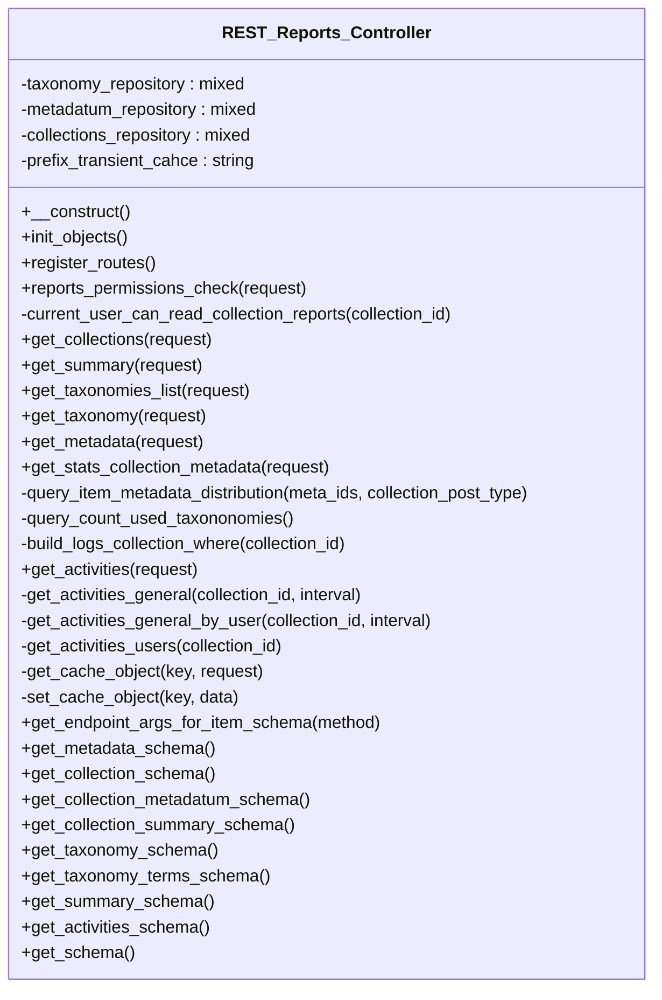

# REST_Reports_Controller

REST API controller for managing Tainacan reports.

Handles all REST API endpoints for report operations including
report generation, data analysis, and statistical reporting.

***

* Full name: `\Tainacan\API\EndPoints\REST_Reports_Controller`
* Parent class: [`\Tainacan\API\REST_Controller`](../REST_Controller)

## Class Diagram



## Properties

### taxonomy_repository

```php
private $taxonomy_repository
```

***

### metadatum_repository

```php
private $metadatum_repository
```

***

### collections_repository

```php
private $collections_repository
```

***

### prefix_transient_cahce

Previous reports were cached under reports_tnc_ and included staff account fields.

```php
private string $prefix_transient_cahce
```

New keys are not read from that prefix, so those transients expire unused.

***

## Methods

### __construct

Constructor for the REST_Controller class.

```php
public __construct(): mixed
```

Sets up the namespace and registers routes and filters.

***

### init_objects

```php
public init_objects(): mixed
```

***

### register_routes

```php
public register_routes(): mixed
```

**Throws:**

- [`Exception`](../../../Exception)

***

### reports_permissions_check

Repository reports match the Reports screen (manage_tainacan).

```php
public reports_permissions_check(\WP_REST_Request $request): bool
```

Collection reports require management of that collection. manage_tainacan and
manage_tainacan_collection_all are not expanded into manage_tainacan_collection_{id},
so each one is checked on its own.

**Parameters:**

| Parameter  | Type                 | Description |
|------------|----------------------|-------------|
| `$request` | **\WP_REST_Request** |             |

***

### current_user_can_read_collection_reports

```php
private current_user_can_read_collection_reports(int $collection_id): bool
```

**Parameters:**

| Parameter        | Type    | Description |
|------------------|---------|-------------|
| `$collection_id` | **int** |             |

***

### get_collections

```php
public get_collections(mixed $request): mixed
```

**Parameters:**

| Parameter  | Type      | Description |
|------------|-----------|-------------|
| `$request` | **mixed** |             |

***

### get_summary

```php
public get_summary(mixed $request): mixed
```

**Parameters:**

| Parameter  | Type      | Description |
|------------|-----------|-------------|
| `$request` | **mixed** |             |

***

### get_taxonomies_list

```php
public get_taxonomies_list(mixed $request): mixed
```

**Parameters:**

| Parameter  | Type      | Description |
|------------|-----------|-------------|
| `$request` | **mixed** |             |

***

### get_taxonomy

```php
public get_taxonomy(mixed $request): mixed
```

**Parameters:**

| Parameter  | Type      | Description |
|------------|-----------|-------------|
| `$request` | **mixed** |             |

***

### get_metadata

```php
public get_metadata(mixed $request): mixed
```

**Parameters:**

| Parameter  | Type      | Description |
|------------|-----------|-------------|
| `$request` | **mixed** |             |

***

### get_stats_collection_metadata

```php
public get_stats_collection_metadata(mixed $request): mixed
```

**Parameters:**

| Parameter  | Type      | Description |
|------------|-----------|-------------|
| `$request` | **mixed** |             |

***

### query_item_metadata_distribution

```php
private query_item_metadata_distribution(mixed $meta_ids, mixed $collection_post_type): mixed
```

**Parameters:**

| Parameter               | Type      | Description |
|-------------------------|-----------|-------------|
| `$meta_ids`             | **mixed** |             |
| `$collection_post_type` | **mixed** |             |

***

### query_count_used_taxononomies

```php
private query_count_used_taxononomies(): mixed
```

***

### build_logs_collection_where

Build a parameterized collection_id WHERE fragment for logs table queries.

```php
private build_logs_collection_where(mixed $collection_id): array{0: string, 1: array}
```

**Parameters:**

| Parameter        | Type      | Description                                                   |
|------------------|-----------|---------------------------------------------------------------|
| `$collection_id` | **mixed** | Collection ID, the literal 'default', or false for no filter. |

**Return Value:**

Tuple of [ $where_sql, $params ].

***

### get_activities

```php
public get_activities(mixed $request): mixed
```

**Parameters:**

| Parameter  | Type      | Description |
|------------|-----------|-------------|
| `$request` | **mixed** |             |

***

### get_activities_general

```php
private get_activities_general(mixed $collection_id = false, mixed $interval = false): mixed
```

**Parameters:**

| Parameter        | Type      | Description |
|------------------|-----------|-------------|
| `$collection_id` | **mixed** |             |
| `$interval`      | **mixed** |             |

***

### get_activities_general_by_user

```php
private get_activities_general_by_user(mixed $collection_id = false, mixed $interval = false): mixed
```

**Parameters:**

| Parameter        | Type      | Description |
|------------------|-----------|-------------|
| `$collection_id` | **mixed** |             |
| `$interval`      | **mixed** |             |

***

### get_activities_users

```php
private get_activities_users(mixed $collection_id = false): mixed
```

**Parameters:**

| Parameter        | Type      | Description |
|------------------|-----------|-------------|
| `$collection_id` | **mixed** |             |

***

### get_cache_object

```php
private get_cache_object(mixed $key, mixed $request): mixed
```

**Parameters:**

| Parameter  | Type      | Description |
|------------|-----------|-------------|
| `$key`     | **mixed** |             |
| `$request` | **mixed** |             |

***

### set_cache_object

```php
private set_cache_object(mixed $key, mixed $data): mixed
```

**Parameters:**

| Parameter | Type      | Description |
|-----------|-----------|-------------|
| `$key`    | **mixed** |             |
| `$data`   | **mixed** |             |

***

### get_endpoint_args_for_item_schema

```php
public get_endpoint_args_for_item_schema(string $method = null): array|mixed
```

**Parameters:**

| Parameter | Type       | Description |
|-----------|------------|-------------|
| `$method` | **string** |             |

***

### get_metadata_schema

```php
public get_metadata_schema(): mixed
```

***

### get_collection_schema

```php
public get_collection_schema(): mixed
```

***

### get_collection_metadatum_schema

```php
public get_collection_metadatum_schema(): mixed
```

***

### get_collection_summary_schema

```php
public get_collection_summary_schema(): mixed
```

***

### get_taxonomy_schema

```php
public get_taxonomy_schema(): mixed
```

***

### get_taxonomy_terms_schema

```php
public get_taxonomy_terms_schema(): mixed
```

***

### get_summary_schema

```php
public get_summary_schema(): mixed
```

***

### get_activities_schema

```php
public get_activities_schema(): mixed
```

***

### get_schema

```php
public get_schema(): mixed
```

***

## Inherited methods

### __construct

Constructor for the REST_Controller class.

```php
public __construct(): mixed
```

Sets up the namespace and registers routes and filters.

***

### filter_object_by_attributes

Filters an object by specified attributes.

```php
protected filter_object_by_attributes(mixed $object, string|array $attributes): array
```

**Parameters:**

| Parameter     | Type              | Description                                       |
|---------------|-------------------|---------------------------------------------------|
| `$object`     | **mixed**         | The object to filter.                             |
| `$attributes` | **string\|array** | The attributes to include in the filtered result. |

**Return Value:**

Filtered object data.

***

### prepare_item_for_updating

Prepares an item for updating with new values.

```php
protected prepare_item_for_updating(mixed $object, array $new_values): \Tainacan\Entities\Entity
```

**Parameters:**

| Parameter     | Type      | Description                      |
|---------------|-----------|----------------------------------|
| `$object`     | **mixed** | The object to update.            |
| `$new_values` | **array** | New values to set on the object. |

**Return Value:**

The updated entity.

***

### prepare_filters

```php
protected prepare_filters(mixed $request): array
```

**Parameters:**

| Parameter  | Type      | Description |
|------------|-----------|-------------|
| `$request` | **mixed** |             |

**Throws:**

- [`Exception`](../../../Exception)

***

### get_minimum_safe_perpage

Positive page size used when a request asks for a non-positive perpage.

```php
protected get_minimum_safe_perpage(): int
```

perpage=-1 would otherwise become posts_per_page=-1 and skip the LIMIT.

***

### add_support_to_tax_query_like

```php
public add_support_to_tax_query_like(mixed $args): mixed
```

**Parameters:**

| Parameter | Type      | Description |
|-----------|-----------|-------------|
| `$args`   | **mixed** |             |

***

### sanitize_value

```php
protected sanitize_value(mixed $value): mixed
```

**Parameters:**

| Parameter | Type      | Description |
|-----------|-----------|-------------|
| `$value`  | **mixed** |             |

***

### contains_array

```php
protected contains_array(mixed $array, mixed $query): bool
```

**Parameters:**

| Parameter | Type      | Description |
|-----------|-----------|-------------|
| `$array`  | **mixed** |             |
| `$query`  | **mixed** |             |

***

### get_fetch_only_param

Return the fetch_only param

```php
public get_fetch_only_param(): array|void
```

***

### get_wp_query_params

Return the common params

```php
public get_wp_query_params(): array|void
```

***

### get_meta_queries_params

Return the common meta, date and tax queries params

```php
protected get_meta_queries_params(): array
```

***

### get_repository_schema

```php
public get_repository_schema(\Tainacan\Repositories\Repository $repository): mixed
```

**Parameters:**

| Parameter     | Type                                  | Description |
|---------------|---------------------------------------|-------------|
| `$repository` | **\Tainacan\Repositories\Repository** |             |

***

### get_permissions_schema

```php
public get_permissions_schema(): mixed
```

***

### get_base_properties_schema

```php
public get_base_properties_schema(): mixed
```

***

### get_schema

```php
protected get_schema(): mixed
```

* This method is **abstract**.
***

### get_list_schema

```php
public get_list_schema(): mixed
```

***

### tainacan_sanitize_post_statuses

Sanitizes and validates a list of post statuses for use in REST requests.

```php
public tainacan_sanitize_post_statuses(string|array $statuses, \WP_REST_Request $request, string $parameter): array|\WP_Error
```

Accepts a list of status slugs (string or array). If it contains 'any',
returns all non-internal post statuses. Otherwise, validates each
status against those allowed by get_post_stati(); returns WP_Error if any
status is invalid.

**Parameters:**

| Parameter    | Type                 | Description                                                    |
|--------------|----------------------|----------------------------------------------------------------|
| `$statuses`  | **string\|array**    | List of statuses (comma-separated string or array of slugs).   |
| `$request`   | **\WP_REST_Request** | REST request object (not used in the current logic).           |
| `$parameter` | **string**           | Parameter name in the request (not used in the current logic). |

**Return Value:**

Array of valid status slugs or WP_Error if any status is not allowed.

***

### validate_array_fields

Reject named fields that are present in a decoded JSON body but are not arrays.

```php
protected validate_array_fields(mixed $body, array $fields): true|\WP_REST_Response
```

JSON bodies read via get_body() bypass REST schema type checks when
Content-Type is not application/json (for example text/plain).

**Parameters:**

| Parameter | Type      | Description                                   |
|-----------|-----------|-----------------------------------------------|
| `$body`   | **mixed** | Decoded request body or nested object.        |
| `$fields` | **array** | Field names that must be arrays when present. |

***
