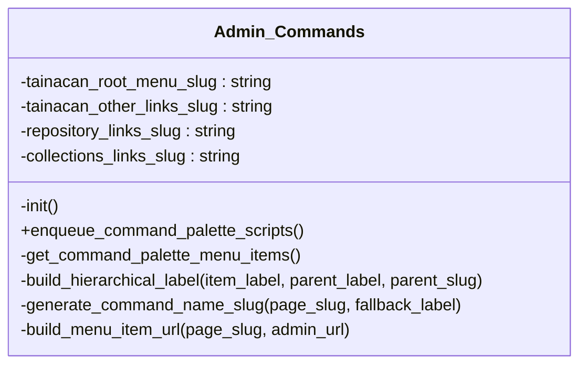

# Admin_Commands

Handles WordPress Command Palette integration for Tainacan.

Registers navigation commands for Tainacan internal pages using the WordPress Command Palette API.
Commands are dynamically generated from the Tainacan admin menu structure.

***

* Full name: `\Tainacan\Admin_Commands`

## Class Diagram



## Properties

### tainacan_root_menu_slug

Root menu slug for all Tainacan admin pages.

```php
private string $tainacan_root_menu_slug
```

***

### tainacan_other_links_slug

Menu slug for the "Others" menu collapse.

```php
private string $tainacan_other_links_slug
```

***

### repository_links_slug

Repository links slug (same as page_slug for the admin Vue component).

```php
private string $repository_links_slug
```

***

### collections_links_slug

Collections links slug.

```php
private string $collections_links_slug
```

***

## Methods

### init

Initializes the admin commands functionality.

```php
private init(): void
```

***

### enqueue_command_palette_scripts

Enqueues scripts and localizes data for the command palette.

```php
public enqueue_command_palette_scripts(): void
```

Command Palette API is only available in WordPress 6.9+.
This method checks the WordPress version before enqueuing scripts.

***

### get_command_palette_menu_items

Collects menu items from Tainacan root menu and other links for command palette.

```php
private get_command_palette_menu_items(): array
```

**Return Value:**

Array of menu items with their labels, URLs, and children.

***

### build_hierarchical_label

Builds a hierarchical label for command palette items.

```php
private build_hierarchical_label(string $item_label, string|null $parent_label = null, string|null $parent_slug = null): string
```

Format: "Tainacan > [Parent] > [Item]" or "Tainacan > [Item]"

**Parameters:**

| Parameter       | Type             | Description                                      |
|-----------------|------------------|--------------------------------------------------|
| `$item_label`   | **string**       | The label of the menu item.                      |
| `$parent_label` | **string\|null** | The label of the parent menu item. Default null. |
| `$parent_slug`  | **string\|null** | The slug of the parent menu item. Default null.  |

**Return Value:**

The hierarchical label.

***

### generate_command_name_slug

Generates a unique command name slug from page slug or label.

```php
private generate_command_name_slug(string $page_slug, string $fallback_label): string
```

For hash routes (e.g., "tainacan_admin#/metadata"), uses the route part after #
to create unique names. For regular pages, uses the page slug or label.

**Parameters:**

| Parameter         | Type       | Description                                         |
|-------------------|------------|-----------------------------------------------------|
| `$page_slug`      | **string** | The page slug from the menu item.                   |
| `$fallback_label` | **string** | The label to use as fallback if page_slug is empty. |

**Return Value:**

The sanitized command name slug.

***

### build_menu_item_url

Builds the URL for a menu item.

```php
private build_menu_item_url(string $page_slug, string $admin_url): string|false
```

**Parameters:**

| Parameter    | Type       | Description                       |
|--------------|------------|-----------------------------------|
| `$page_slug` | **string** | The page slug from the menu item. |
| `$admin_url` | **string** | The admin URL base.               |

**Return Value:**

The built URL or false if invalid.

***

## Inherited methods

### get_instance

```php
public static get_instance(): mixed
```

* This method is **static**.
***

### __construct

```php
private __construct(): mixed
```

***
