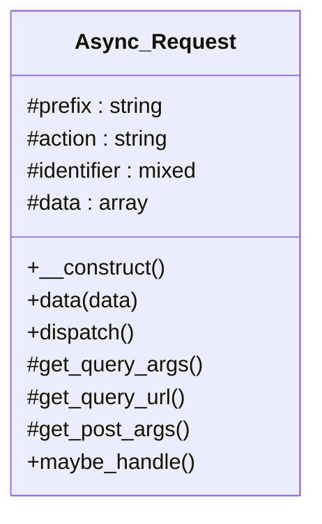

# Async_Request

Abstract base class for asynchronous requests.

Provides the foundation for handling asynchronous HTTP requests
in WordPress, typically used for background processing tasks.

***

* Full name: `\Tainacan\Async_Request`
* This class is an **Abstract class**

## Class Diagram



## Properties

### prefix

Request prefix for identifying the async request.

```php
protected string $prefix
```

***

### action

Action name for the async request.

```php
protected string $action
```

***

### identifier

Unique identifier for this request.

```php
protected mixed $identifier
```

***

### data

Data to be sent with the async request.

```php
protected array $data
```

***

## Methods

### __construct

Constructor for the Async_Request class.

```php
public __construct(): mixed
```

Initializes the async request with a unique identifier.

***

### data

Set data used during the request

```php
public data(array $data): $this
```

**Parameters:**

| Parameter | Type      | Description |
|-----------|-----------|-------------|
| `$data`   | **array** | Data.       |

***

### dispatch

Dispatch the async request

```php
public dispatch(): array|\Tainacan\WP_Error
```

***

### get_query_args

Get query args

```php
protected get_query_args(): array
```

***

### get_query_url

Get query URL

```php
protected get_query_url(): string
```

The dispatch mechanism sends an HTTP request back to this site
(admin-ajax.php) to trigger the background process asynchronously.
In some environments — notably Docker-based development stacks where
the public `siteurl`/`home` option points at a host port (e.g.
`http://localhost:8080`) that is not reachable from inside the
container — the loopback request fails silently and the process
never starts until WP-Cron eventually fires.

To fix this, define `TAINACAN_BG_PROCESS_LOOPBACK_URL` in
`wp-config.php` with an internally-reachable base URL (e.g.
`http://localhost` inside the container). When set, the dispatch
request targets that URL instead of `admin_url()`, while the rest
of WordPress (REST API, admin pages, etc.) keeps using the public
`siteurl`. This makes background processes dispatch immediately,
without waiting for the WP-Cron schedule.

***

### get_post_args

Get post args

```php
protected get_post_args(): array
```

The dispatch loopback request is sent to admin-ajax.php on this same
server. Because maybe_handle() verifies a nonce via check_ajax_referer()
— and WordPress nonces are tied to the logged-in user — the loopback
request must carry the same user's authentication cookies as the
request that queued the process. Without cookies, the loopback arrives
as an unauthenticated (user 0) request and the nonce generated by the
admin who queued the process fails validation, so the background
process never starts until WP-Cron eventually fires.

Forwarding the auth cookies makes the immediate dispatch work reliably
in every environment (shared hosting, Docker, etc.).

***

### maybe_handle

Maybe handle

```php
public maybe_handle(): mixed
```

Check for correct nonce and pass to handler.

***

### handle

Handle

```php
protected handle(): mixed
```

Override this method to perform any actions required
during the async request.

* This method is **abstract**.
***
