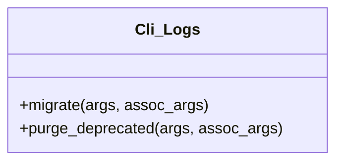

# Cli_Logs


Manages Tainacan activity log data migration from the legacy wp_posts structure.

wp tainacan logs migrate          # migra os logs do wp_posts → tainacan_logs
wp tainacan logs migrate --dry-run
wp tainacan logs migrate --batch-size=100 --yes

wp tainacan logs purge-deprecated            # apaga os registros já migrados do wp_posts
wp tainacan logs purge-deprecated --dry-run
wp tainacan logs purge-deprecated --batch-size=200 --yes

***

* Full name: `\Tainacan\Cli_Logs`

## Class Diagram



## Methods

### migrate

Migrate Tainacan activity logs from the legacy wp_posts structure to the dedicated tainacan_logs table.

```php
public migrate(mixed $args, mixed $assoc_args): mixed
```

Safe to run multiple times. Already-migrated records are skipped automatically
(tracked via _wp_posts_log_migration_ref).

## OPTIONS

[--batch-size=<number>]
: Number of logs to process per batch. Default: 50.

[--dry-run]
: Show how many logs are pending migration without making any changes.

[--yes]
: Skip the confirmation prompt.

## EXAMPLES

    wp tainacan logs migrate
    wp tainacan logs migrate --batch-size=100 --yes
    wp tainacan logs migrate --dry-run

**Parameters:**

| Parameter     | Type      | Description |
|---------------|-----------|-------------|
| `$args`       | **mixed** |             |
| `$assoc_args` | **mixed** |             |

***

### purge_deprecated

Delete legacy tainacan-log records from wp_posts/wp_postmeta that have already been migrated to tainacan_logs.

```php
public purge_deprecated(mixed $args, mixed $assoc_args): mixed
```

Only records whose wp_posts ID is referenced in tainacan_logs._wp_posts_log_migration_ref
are removed. Non-migrated logs are never touched.
Safe to run multiple times.

## OPTIONS

[--batch-size=<number>]
: Number of records to delete per batch. Default: 50.

[--dry-run]
: Show how many records are eligible for deletion without making any changes.

[--yes]
: Skip the confirmation prompt.

## EXAMPLES

    wp tainacan logs purge-deprecated
    wp tainacan logs purge-deprecated --batch-size=200 --yes
    wp tainacan logs purge-deprecated --dry-run

**Parameters:**

| Parameter     | Type      | Description |
|---------------|-----------|-------------|
| `$args`       | **mixed** |             |
| `$assoc_args` | **mixed** |             |

***
