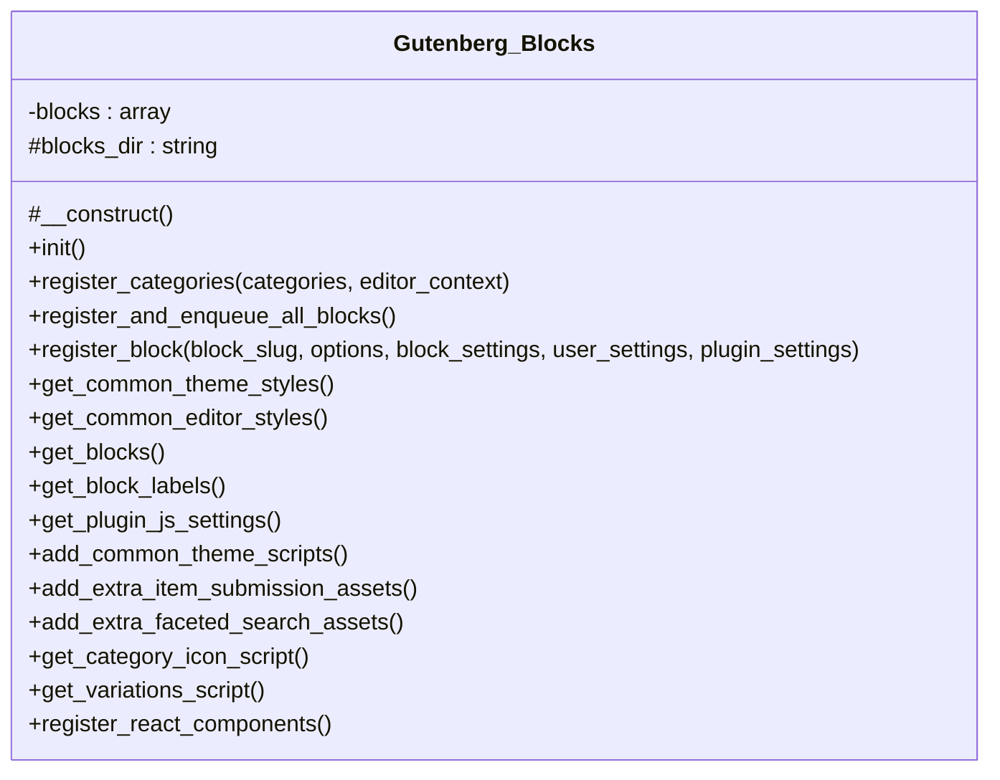

# Gutenberg_Blocks


Handles registration of Tainacan Gutenberg blocks and Query loop variations.

Not a page; provides block list and labels for Settings and filters registration by options.

***

* Full name: `\Tainacan\Gutenberg_Blocks`

## Class Diagram



## Properties

### blocks

Slugs and options for the Tainacan Blocks.

```php
private static array<string,array> $blocks
```

* This property is **static**.

***

### blocks_dir

Plugin blocks directory (without trailing slash).

```php
protected string $blocks_dir
```

***

## Methods

### __construct

```php
protected __construct(): mixed
```

***

### init

Initialize the Gutenberg Blocks logic, only if possible.

```php
public init(): mixed
```

Via Gutenberg filters, we create the Tainacan category.
On the theme side, all we need is the common scripts that handle dynamically the imports using conditioner.js.
On the admin side, we need the blocks registered and their assets (editor-side). The reason why we don't use
admin_init here is because server side blocks need to be registered within the init.
Additionally, we also register the Tainacan react components that may be used by block editor scripts and plugin extenders.

***

### register_categories

Registers the Tainacan category on the blocks inserter.

```php
public register_categories(array $categories, mixed $editor_context): array
```

**Parameters:**

| Parameter         | Type      | Description |
|-------------------|-----------|-------------|
| `$categories`     | **array** |             |
| `$editor_context` | **mixed** |             |

***

### register_and_enqueue_all_blocks

Calls the routines responsible for registering the global style, category and both 'generic' and 'special' blocks.

```php
public register_and_enqueue_all_blocks(): mixed
```

Only registers blocks that are enabled in settings (or all if none selected).

***

### register_block

Registers a 'generic' Tainacan Block, according to the BLOCKS array.

```php
public register_block(string $block_slug, array $options = [], array $block_settings = [], array $user_settings = [], array $plugin_settings = []): mixed
```

**Parameters:**

| Parameter          | Type       | Description                                                                                                                                    |
|--------------------|------------|------------------------------------------------------------------------------------------------------------------------------------------------|
| `$block_slug`      | **string** | The block slug.                                                                                                                                |
| `$options`         | **array**  | Optional. Array of arguments. @type array $extra_editor_script_deps Array of strings containing script dependencies of the editor side script. |
| `$block_settings`  | **array**  | JSON array containing the block settings from the server.                                                                                      |
| `$user_settings`   | **array**  | JSON array containing the user settings from the server.                                                                                       |
| `$plugin_settings` | **array**  | JSON array containing the plugin settings from the server.                                                                                     |

***

### get_common_theme_styles

Enqueues the global theme styles necessary for the majority of the blocks.

```php
public get_common_theme_styles(): mixed
```

***

### get_common_editor_styles

Enqueues the global editor styles necessary for the majority of the blocks.

```php
public get_common_editor_styles(): mixed
```

***

### get_blocks

Returns the block list (slug => options) for Settings and internal use.

```php
public get_blocks(): array<string,array>
```

***

### get_block_labels

Returns block slug => label for Settings checkboxes. Reads title from each block's block.json.

```php
public get_block_labels(): array<string,string>
```

***

### get_plugin_js_settings

Generates the global 'tainacan_blocks' that contains some info from PHP necessary to the blocks scripts in JS.

```php
public get_plugin_js_settings(): array
```

Also includes the variation enable/disable flags for the Query loop variations script.

***

### add_common_theme_scripts

Effectively enqueues the common js and passes the necessary global variables.

```php
public add_common_theme_scripts(): mixed
```

Hooks into block rendering to detect and immediately enqueue extra assets when needed.

***

### add_extra_item_submission_assets

Registers the extra scripts necessary for item submission block.

```php
public add_extra_item_submission_assets(): mixed
```

Registers extra script for Google ReCAPTCHA and extra metadata type forms.

***

### add_extra_faceted_search_assets

Registers the extra styles necessary for faceted search block.

```php
public add_extra_faceted_search_assets(): mixed
```

***

### get_category_icon_script

Registers the script that inserts the Tainacan icon on the blocks category.

```php
public get_category_icon_script(): mixed
```

***

### get_variations_script

Registers the script that inserts the Query Loop Block variations.

```php
public get_variations_script(): mixed
```

Passes block settings (including variation enable/disable flags) to the script.

***

### register_react_components

Registers Tainacan react components that may be used by either block editor scripts or plugin extenders.

```php
public register_react_components(): mixed
```

***

## Inherited methods

### get_instance

```php
public static get_instance(): mixed
```

* This method is **static**.
***

### __construct

```php
private __construct(): mixed
```

***
