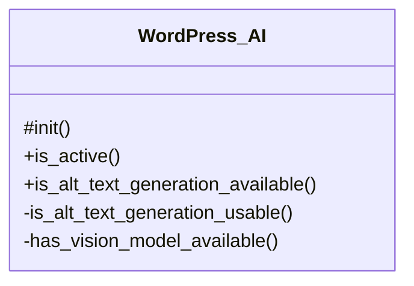

# WordPress_AI

Integration with the WordPress AI plugin (https://github.com/WordPress/ai).

***

* Full name: `\Tainacan\Integrations\WordPress_AI`

## Class Diagram



## Constants

| Constant          | Visibility | Type   | Value       |
|-------------------|------------|--------|-------------|
| `PLUGIN_BASENAME` | public     | string | 'ai/ai.php' |

## Methods

### init

Reserved for future WordPress AI integration hooks.

```php
protected init(): mixed
```

***

### is_active

Whether the WordPress AI plugin is active.

```php
public is_active(): bool
```

When the plugin is enabled, WordPress loads ai/ai.php, which defines WPAI_VERSION
and instantiates Main in the same request (see WordPress/ai ai.php).

***

### is_alt_text_generation_available

Whether alt-text generation should be offered in the item editor.

```php
public is_alt_text_generation_available(): bool
```

***

### is_alt_text_generation_usable

Whether the alt-text ability can run (feature, credentials, vision model).

```php
private is_alt_text_generation_usable(): bool
```

***

### has_vision_model_available

Whether any active AI connector exposes a vision-capable model.

```php
private has_vision_model_available(): bool
```

Uses the same requirements as the WordPress AI REST Models_Controller for capability "vision".

***

## Inherited methods

### get_instance

```php
public static get_instance(): mixed
```

* This method is **static**.
***

### __construct

```php
private __construct(): mixed
```

***
