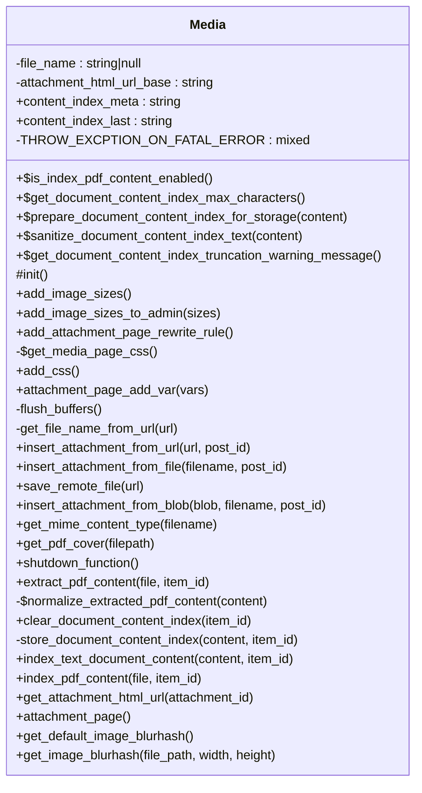

# Media

Handles media functionality for Tainacan.

Provides methods for managing images, attachments, and media-related features
including custom image sizes, attachment pages, and content indexing.

***

* Full name: `\Tainacan\Media`

## Class Diagram



## Constants

| Constant                                        | Visibility | Type | Value   |
|-------------------------------------------------|------------|------|---------|
| `DOCUMENT_CONTENT_INDEX_MAX_CHARACTERS_DEFAULT` | public     |      | 200000  |
| `DOCUMENT_CONTENT_INDEX_MAX_CHARACTERS_LIMIT`   | public     |      | 2000000 |

## Properties

### file_name

Current file name being processed.

```php
private static string|null $file_name
```

* This property is **static**.

***

### attachment_html_url_base

Base URL slug for attachment HTML pages.

```php
private string $attachment_html_url_base
```

***

### content_index_meta

Meta key for document content indexing.

```php
public static string $content_index_meta
```

* This property is **static**.

***

### content_index_last

Meta key for document content last index metadata.

```php
public static string $content_index_last
```

* This property is **static**.

***

### THROW_EXCPTION_ON_FATAL_ERROR

```php
private $THROW_EXCPTION_ON_FATAL_ERROR
```

***

## Methods

### is_index_pdf_content_enabled

Whether automatic PDF text extraction is enabled.

```php
public static is_index_pdf_content_enabled(): bool
```

* This method is **static**.
***

### get_document_content_index_max_characters

Configured maximum document content index length in characters.

```php
public static get_document_content_index_max_characters(): int
```

* This method is **static**.
***

### prepare_document_content_index_for_storage

Truncates document content to the configured maximum length before storage.

```php
public static prepare_document_content_index_for_storage(mixed $content): array
```

* This method is **static**.
**Parameters:**

| Parameter  | Type      | Description           |
|------------|-----------|-----------------------|
| `$content` | **mixed** | Raw document content. |

**Return Value:**

{
    @type mixed  $content       Content ready for storage.
    @type bool   $was_truncated Whether the content was cropped.
}

***

### sanitize_document_content_index_text

Cleans extracted document content before it is returned or stored.

```php
public static sanitize_document_content_index_text(string $content): string
```

Intended for automatic extraction only; manual edits should not pass through this.

* This method is **static**.
**Parameters:**

| Parameter  | Type       | Description         |
|------------|------------|---------------------|
| `$content` | **string** | Raw extracted text. |

***

### get_document_content_index_truncation_warning_message

Human-readable warning when document content was truncated.

```php
public static get_document_content_index_truncation_warning_message(): string
```

* This method is **static**.
***

### init

Initializes the media functionality.

```php
protected init(): void
```

Sets up rewrite rules, query vars, and image sizes for Tainacan media handling.

***

### add_image_sizes

Registers custom image sizes for Tainacan.

```php
public add_image_sizes(): void
```

***

### add_image_sizes_to_admin

Adds custom image sizes to the admin interface.

```php
public add_image_sizes_to_admin(array $sizes): array
```

**Parameters:**

| Parameter | Type      | Description                  |
|-----------|-----------|------------------------------|
| `$sizes`  | **array** | Existing image size options. |

**Return Value:**

Modified image size options.

***

### add_attachment_page_rewrite_rule

Adds rewrite rule for attachment HTML pages.

```php
public add_attachment_page_rewrite_rule(): void
```

***

### get_media_page_css

Gets the CSS styles for media attachment pages.

```php
private static get_media_page_css(): string
```

* This method is **static**.
**Return Value:**

CSS content for media attachment pages.

***

### add_css

Adds inline CSS for media attachment pages. (Too small to be a separate file)

```php
public add_css(): void
```

***

### attachment_page_add_var

```php
public attachment_page_add_var(mixed $vars): mixed
```

**Parameters:**

| Parameter | Type      | Description |
|-----------|-----------|-------------|
| `$vars`   | **mixed** |             |

***

### flush_buffers

```php
private flush_buffers(): mixed
```

***

### get_file_name_from_url

```php
private get_file_name_from_url(mixed $url): mixed
```

**Parameters:**

| Parameter | Type      | Description |
|-----------|-----------|-------------|
| `$url`    | **mixed** |             |

***

### insert_attachment_from_url

Insert an attachment from an URL address.

```php
public insert_attachment_from_url(string $url, int $post_id = null): int|false
```

**Parameters:**

| Parameter  | Type       | Description                                                                |
|------------|------------|----------------------------------------------------------------------------|
| `$url`     | **string** |                                                                            |
| `$post_id` | **int**    | (optional) the post this attachement should be attached to. empty for none |

**Return Value:**

Attachment ID. False on failure

***

### insert_attachment_from_file

Insert an attachment from a local file.

```php
public insert_attachment_from_file(string $filename, int $post_id = null): int|false
```

**Parameters:**

| Parameter   | Type       | Description                                                                |
|-------------|------------|----------------------------------------------------------------------------|
| `$filename` | **string** | The path to the file                                                       |
| `$post_id`  | **int**    | (optional) the post this attachement should be attached to. empty for none |

**Return Value:**

Attachment ID. False on failure

***

### save_remote_file

Avoid memory overflow problems with large files (Exceeded maximum memory limit of PHP)

```php
public save_remote_file(mixed $url): string
```

**Parameters:**

| Parameter | Type      | Description |
|-----------|-----------|-------------|
| `$url`    | **mixed** |             |

**Return Value:**

the file path

***

### insert_attachment_from_blob

Insert an attachment from an URL address.

```php
public insert_attachment_from_blob(\Tainacan\blob $blob, string $filename, int $post_id = null): int|false
```

**Parameters:**

| Parameter   | Type               | Description                                                                |
|-------------|--------------------|----------------------------------------------------------------------------|
| `$blob`     | **\Tainacan\blob** | bitstream of the attachment                                                |
| `$filename` | **string**         | The filename that will be created                                          |
| `$post_id`  | **int**            | (optional) the post this attachement should be attached to. empty for none |

**Return Value:**

Attachment ID. False on failure

***

### get_mime_content_type

Add support to get mime type content even when mime_content_type function is not available

```php
public get_mime_content_type(string $filename): string
```

**Parameters:**

| Parameter   | Type       | Description                          |
|-------------|------------|--------------------------------------|
| `$filename` | **string** | The file name to check the mime type |

**Return Value:**

mime type           @see \mime_content_type()

***

### get_pdf_cover

Extract an image from the first page of a pdf file

```php
public get_pdf_cover(string $filepath): \Tainacan\blob
```

**Parameters:**

| Parameter   | Type       | Description                    |
|-------------|------------|--------------------------------|
| `$filepath` | **string** | The pdf filepath in the server |

**Return Value:**

bitstream of the image in jpg format

***

### shutdown_function

```php
public shutdown_function(): mixed
```

***

### extract_pdf_content

Extract textual content from a PDF file

```php
public extract_pdf_content(string $file, int|null $item_id = null): string|bool|null
```

**Parameters:**

| Parameter  | Type          | Description                    |
|------------|---------------|--------------------------------|
| `$file`    | **string**    | Absolute path to the PDF file. |
| `$item_id` | **int\|null** | Optional item ID for filters.  |

**Return Value:**

Extracted text, false on failure, null when not a PDF, or a boolean when a filter handles extraction.

***

### normalize_extracted_pdf_content

Validates and sanitizes extracted PDF text before it is returned or stored.

```php
private static normalize_extracted_pdf_content(mixed $content): string|bool|null|false
```

* This method is **static**.
**Parameters:**

| Parameter  | Type      | Description            |
|------------|-----------|------------------------|
| `$content` | **mixed** | Raw extraction result. |

***

### clear_document_content_index

Clears stored document content index metadata for an item.

```php
public clear_document_content_index(int $item_id): bool
```

**Parameters:**

| Parameter  | Type    | Description  |
|------------|---------|--------------|
| `$item_id` | **int** | The item ID. |

***

### store_document_content_index

Stores document content index metadata, cropping when above the configured limit.

```php
private store_document_content_index(string $content, int $item_id): bool
```

**Parameters:**

| Parameter  | Type       | Description       |
|------------|------------|-------------------|
| `$content` | **string** | Document content. |
| `$item_id` | **int**    | Item ID.          |

**Return Value:**

Whether the content was truncated.

***

### index_text_document_content

Stores text document content in the document content index for search.

```php
public index_text_document_content(string $content, int $item_id): bool
```

**Parameters:**

| Parameter  | Type       | Description                |
|------------|------------|----------------------------|
| `$content` | **string** | The text document content. |
| `$item_id` | **int**    | The item ID.               |

***

### index_pdf_content

```php
public index_pdf_content(mixed $file, mixed $item_id): mixed
```

**Parameters:**

| Parameter  | Type      | Description |
|------------|-----------|-------------|
| `$file`    | **mixed** |             |
| `$item_id` | **mixed** |             |

***

### get_attachment_html_url

```php
public get_attachment_html_url(mixed $attachment_id): mixed
```

**Parameters:**

| Parameter        | Type      | Description |
|------------------|-----------|-------------|
| `$attachment_id` | **mixed** |             |

***

### attachment_page

```php
public attachment_page(): mixed
```

***

### get_default_image_blurhash

```php
public get_default_image_blurhash(): mixed
```

***

### get_image_blurhash

```php
public get_image_blurhash(mixed $file_path, mixed $width, mixed $height): mixed
```

**Parameters:**

| Parameter    | Type      | Description |
|--------------|-----------|-------------|
| `$file_path` | **mixed** |             |
| `$width`     | **mixed** |             |
| `$height`    | **mixed** |             |

***

## Inherited methods

### get_instance

```php
public static get_instance(): mixed
```

* This method is **static**.
***

### __construct

```php
private __construct(): mixed
```

***
