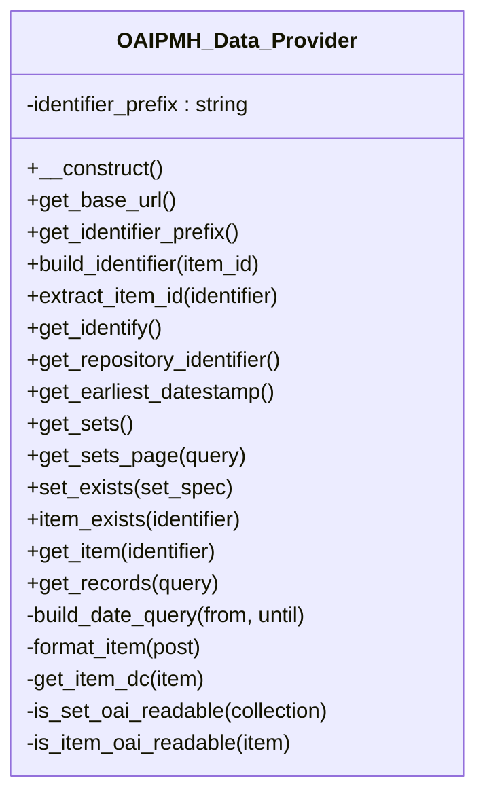

# OAIPMH_Data_Provider

OAI-PMH data provider.

Maps Tainacan entities (collections, items, item metadata) to the array
structures consumed by 

- **See:** \Tainacan\OAIPMH\OAIPMH_Xml_Generator. All data access is done
through Tainacan repositories/entities, except the earliestDatestamp
aggregate which is a justified direct query.

***

* Full name: `\Tainacan\OAIPMH\OAIPMH_Data_Provider`

## Class Diagram



## Constants

| Constant             | Visibility | Type | Value                        |
|----------------------|------------|------|------------------------------|
| `EARLIEST_TRANSIENT` | public     |      | 'tnc_oai_earliest_datestamp' |

## Properties

### identifier_prefix

Identifier prefix, e.g. "oai:example.org:".

```php
private string $identifier_prefix
```

***

## Methods

### __construct

```php
public __construct(): mixed
```

***

### get_base_url

Base URL advertised by the provider.

```php
public get_base_url(): string
```

***

### get_identifier_prefix

```php
public get_identifier_prefix(): string
```

***

### build_identifier

```php
public build_identifier(int $item_id): string
```

**Parameters:**

| Parameter  | Type    | Description |
|------------|---------|-------------|
| `$item_id` | **int** |             |

***

### extract_item_id

```php
public extract_item_id(string $identifier): int
```

**Parameters:**

| Parameter     | Type       | Description |
|---------------|------------|-------------|
| `$identifier` | **string** |             |

***

### get_identify

Build the Identify response.

```php
public get_identify(): array
```

***

### get_repository_identifier

Repository identifier for the oai-identifier description block.

```php
public get_repository_identifier(): string
```

***

### get_earliest_datestamp

Earliest item datestamp in the repository (UTC), cached for a day.

```php
public get_earliest_datestamp(): string
```

***

### get_sets

List collections as OAI sets.

```php
public get_sets(): array
```

***

### get_sets_page

Fetch a page of OAI sets (Tainacan collections).

```php
public get_sets_page(array $query): array
```

**Parameters:**

| Parameter | Type      | Description                                                                 |
|-----------|-----------|-----------------------------------------------------------------------------|
| `$query`  | **array** | {
    @type int $page 1-based page number.
    @type int $per  Page size.
} |

**Return Value:**

{ @type array $sets; @type int $total }

***

### set_exists

Whether a setSpec maps to an existing collection.

```php
public set_exists(string $set_spec): bool
```

Sets are Tainacan collections, identified by numeric IDs. Non-numeric
specs are rejected on purpose (yields badArgument upstream).

**Parameters:**

| Parameter   | Type       | Description |
|-------------|------------|-------------|
| `$set_spec` | **string** |             |

***

### item_exists

```php
public item_exists(string $identifier): bool
```

**Parameters:**

| Parameter     | Type       | Description |
|---------------|------------|-------------|
| `$identifier` | **string** |             |

***

### get_item

Fetch a single formatted record by OAI identifier.

```php
public get_item(string $identifier): array|null
```

**Parameters:**

| Parameter     | Type       | Description |
|---------------|------------|-------------|
| `$identifier` | **string** |             |

***

### get_records

Fetch a page of records, with the matching total in a single query.

```php
public get_records(array $query): array
```

**Parameters:**

| Parameter | Type      | Description                                                                                                                                                                                                                                                            |
|-----------|-----------|------------------------------------------------------------------------------------------------------------------------------------------------------------------------------------------------------------------------------------------------------------------------|
| `$query`  | **array** | {
    @type int    $page  1-based page number.
    @type int    $per   Page size.
    @type int    $set   Optional collection ID filter.
    @type string $from  Optional lower datestamp bound (UTC).
    @type string $until Optional upper datestamp bound (UTC).
} |

**Return Value:**

{ @type array $items; @type int $total }

***

### build_date_query

Build a WP_Query date_query on post_modified_gmt from OAI from/until.

```php
private build_date_query(string|null $from, string|null $until): array
```

**Parameters:**

| Parameter | Type             | Description |
|-----------|------------------|-------------|
| `$from`   | **string\|null** |             |
| `$until`  | **string\|null** |             |

***

### format_item

Map an item (post or ID) to the OAI record array.

```php
private format_item(\WP_Post|int $post): array|null
```

**Parameters:**

| Parameter | Type              | Description |
|-----------|-------------------|-------------|
| `$post`   | **\WP_Post\|int** |             |

***

### get_item_dc

Build the Dublin Core field map for an item.

```php
private get_item_dc(\Tainacan\Entities\Item $item): array
```

**Parameters:**

| Parameter | Type                        | Description |
|-----------|-----------------------------|-------------|
| `$item`   | **\Tainacan\Entities\Item** |             |

***

### is_set_oai_readable

Whether a collection may appear as an OAI set for anonymous harvesters.

```php
private is_set_oai_readable(\Tainacan\Entities\Collection $collection): bool
```

Uses publish status explicitly so logged-in administrators browsing the
endpoint do not widen the public harvest surface.

**Parameters:**

| Parameter     | Type                              | Description |
|---------------|-----------------------------------|-------------|
| `$collection` | **\Tainacan\Entities\Collection** |             |

***

### is_item_oai_readable

Whether an item may be disseminated through the public OAI-PMH interface.

```php
private is_item_oai_readable(\Tainacan\Entities\Item $item): bool
```

Published items in published collections are harvestable. Trashed items
remain visible as header-only records when deletedRecord=transient. All
other statuses are withheld regardless of the current user session.

**Parameters:**

| Parameter | Type                        | Description |
|-----------|-----------------------------|-------------|
| `$item`   | **\Tainacan\Entities\Item** |             |

***
