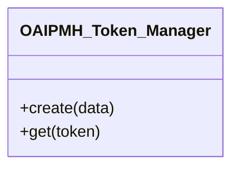

# OAIPMH_Token_Manager

resumptionToken storage backed by WordPress transients.

Tokens carry the pagination state of a ListRecords/ListIdentifiers harvest.
Transients give automatic expiration and need no custom table, removing the
filesystem tokens used by the legacy implementation.

***

* Full name: `\Tainacan\OAIPMH\OAIPMH_Token_Manager`

## Class Diagram



## Constants

| Constant           | Visibility | Type | Value            |
|--------------------|------------|------|------------------|
| `TRANSIENT_PREFIX` | public     |      | 'tnc_oai_token_' |

## Methods

### create

Persist a pagination state and return its opaque token.

```php
public create(array $data): string
```

**Parameters:**

| Parameter | Type      | Description |
|-----------|-----------|-------------|
| `$data`   | **array** |             |

***

### get

Retrieve the pagination state for a token.

```php
public get(string $token): array|false
```

**Parameters:**

| Parameter | Type       | Description |
|-----------|------------|-------------|
| `$token`  | **string** |             |

***
