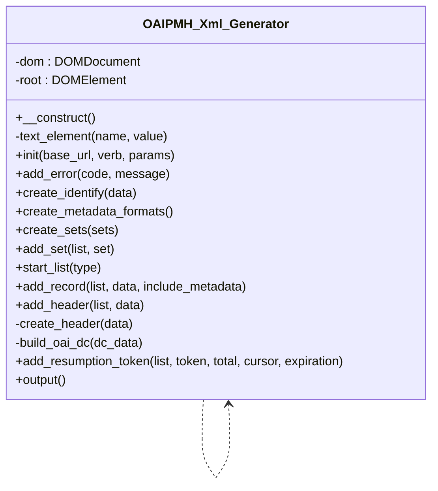

# OAIPMH_Xml_Generator

Builds OAI-PMH 2.0 XML responses with DOMDocument.

Element text is added through DOMDocument::createTextNode, which escapes
special characters exactly once, so callers pass raw values.

***

* Full name: `\Tainacan\OAIPMH\OAIPMH_Xml_Generator`

## Class Diagram



## Constants

| Constant    | Visibility | Type | Value                                         |
|-------------|------------|------|-----------------------------------------------|
| `OAI_NS`    | public     |      | 'http://www.openarchives.org/OAI/2.0/'        |
| `XSI_NS`    | public     |      | 'http://www.w3.org/2001/XMLSchema-instance'   |
| `DC_NS`     | public     |      | 'http://purl.org/dc/elements/1.1/'            |
| `OAI_DC_NS` | public     |      | 'http://www.openarchives.org/OAI/2.0/oai_dc/' |

## Properties

### dom

```php
private \DOMDocument $dom
```

***

### root

```php
private \DOMElement $root
```

***

## Methods

### __construct

```php
public __construct(): mixed
```

***

### text_element

Create an element holding a single (escaped) text value.

```php
private text_element(string $name, string $value): \DOMElement
```

**Parameters:**

| Parameter | Type       | Description |
|-----------|------------|-------------|
| `$name`   | **string** |             |
| `$value`  | **string** |             |

***

### init

Initialise the response envelope.

```php
public init(string $base_url, string $verb, array $params = array()): \Tainacan\OAIPMH\OAIPMH_Xml_Generator
```

**Parameters:**

| Parameter   | Type       | Description |
|-------------|------------|-------------|
| `$base_url` | **string** |             |
| `$verb`     | **string** |             |
| `$params`   | **array**  |             |

***

### add_error

```php
public add_error(string $code, string $message = ''): \Tainacan\OAIPMH\OAIPMH_Xml_Generator
```

**Parameters:**

| Parameter  | Type       | Description |
|------------|------------|-------------|
| `$code`    | **string** |             |
| `$message` | **string** |             |

***

### create_identify

```php
public create_identify(array $data): \Tainacan\OAIPMH\OAIPMH_Xml_Generator
```

**Parameters:**

| Parameter | Type      | Description |
|-----------|-----------|-------------|
| `$data`   | **array** |             |

***

### create_metadata_formats

```php
public create_metadata_formats(): \Tainacan\OAIPMH\OAIPMH_Xml_Generator
```

***

### create_sets

```php
public create_sets(array $sets): \Tainacan\OAIPMH\OAIPMH_Xml_Generator
```

**Parameters:**

| Parameter | Type      | Description |
|-----------|-----------|-------------|
| `$sets`   | **array** |             |

***

### add_set

```php
public add_set(\DOMElement $list, array $set): \Tainacan\OAIPMH\OAIPMH_Xml_Generator
```

**Parameters:**

| Parameter | Type            | Description |
|-----------|-----------------|-------------|
| `$list`   | **\DOMElement** |             |
| `$set`    | **array**       |             |

***

### start_list

Start a verb list node (ListRecords/ListIdentifiers/GetRecord).

```php
public start_list(string $type): \DOMElement
```

**Parameters:**

| Parameter | Type       | Description |
|-----------|------------|-------------|
| `$type`   | **string** |             |

***

### add_record

```php
public add_record(\DOMElement $list, array $data, bool $include_metadata = true): \Tainacan\OAIPMH\OAIPMH_Xml_Generator
```

**Parameters:**

| Parameter           | Type            | Description |
|---------------------|-----------------|-------------|
| `$list`             | **\DOMElement** |             |
| `$data`             | **array**       |             |
| `$include_metadata` | **bool**        |             |

***

### add_header

```php
public add_header(\DOMElement $list, array $data): \Tainacan\OAIPMH\OAIPMH_Xml_Generator
```

**Parameters:**

| Parameter | Type            | Description |
|-----------|-----------------|-------------|
| `$list`   | **\DOMElement** |             |
| `$data`   | **array**       |             |

***

### create_header

```php
private create_header(array $data): \DOMElement
```

**Parameters:**

| Parameter | Type      | Description |
|-----------|-----------|-------------|
| `$data`   | **array** |             |

***

### build_oai_dc

Build an <oai_dc:dc> node from a Dublin Core field map.

```php
private build_oai_dc(array $dc_data): \DOMElement
```

**Parameters:**

| Parameter  | Type      | Description |
|------------|-----------|-------------|
| `$dc_data` | **array** |             |

***

### add_resumption_token

```php
public add_resumption_token(\DOMElement $list, string $token = '', int|null $total = null, int|null $cursor = null, string|null $expiration = null): \Tainacan\OAIPMH\OAIPMH_Xml_Generator
```

**Parameters:**

| Parameter     | Type             | Description |
|---------------|------------------|-------------|
| `$list`       | **\DOMElement**  |             |
| `$token`      | **string**       |             |
| `$total`      | **int\|null**    |             |
| `$cursor`     | **int\|null**    |             |
| `$expiration` | **string\|null** |             |

***

### output

```php
public output(): string
```

***
