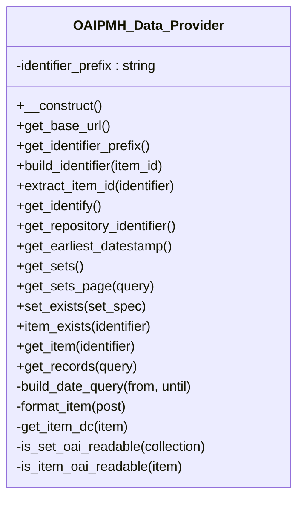

# OAIPMH_Data_Provider

OAI-PMH data provider: maps Tainacan collections, items, and Dublin Core metadata to structures consumed by `OAIPMH_Xml_Generator`.

* Full name: `\Tainacan\OAIPMHExpose\OAIPMH_Data_Provider`

## Class Diagram

## Methods

| Method | Description |
|--------|-------------|
| `get_base_url()` | REST base URL advertised on Identify |
| `get_identify()` | Identify response field map |
| `get_earliest_datestamp()` | Cached MIN(post_modified_gmt) for published/trashed items |
| `get_sets()` | Collections as OAI sets |
| `get_records( $query )` | Paginated harvest query (set, from, until) |
| `get_item( $identifier )` | Single record by OAI identifier |
| `build_identifier( $item_id )` | Host-based OAI identifier |
| `extract_item_id( $identifier )` | Parses host-based and legacy reversed-domain identifiers |

Dublin Core fields are built from item core properties plus each metadatum's `exposer_mapping['dublin-core']`.
