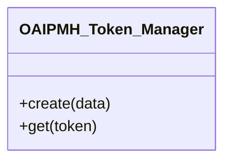

# OAIPMH_Token_Manager

Stores ListRecords/ListIdentifiers pagination state in WordPress transients.

* Full name: `\Tainacan\OAIPMHExpose\OAIPMH_Token_Manager`

## Class Diagram

## Methods

| Method | Description |
|--------|-------------|
| `create( array $data )` | Persist query state; return opaque token |
| `get( $token )` | Retrieve state or false when invalid/expired |

Token lifetime is filterable via `tainacan-oai-token-valid` (default 24 hours).
