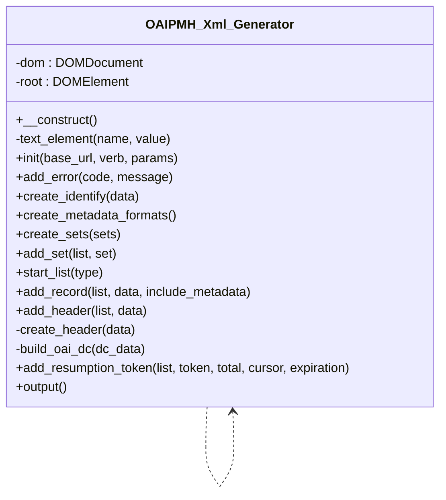

# OAIPMH_Xml_Generator

Builds OAI-PMH 2.0 XML responses with `DOMDocument`. Element text is escaped via `createTextNode`.

* Full name: `\Tainacan\OAIPMHExpose\OAIPMH_Xml_Generator`

## Class Diagram

## Methods

| Method | Description |
|--------|-------------|
| `init( $base_url, $verb, $params )` | OAI-PMH envelope and request element |
| `add_error( $code, $message )` | OAI error node |
| `create_identify( $data )` | Identify verb, including oai-identifier description |
| `create_metadata_formats()` | ListMetadataFormats (oai_dc) |
| `create_sets( $sets )` | ListSets |
| `start_list( $type )` | ListRecords / ListIdentifiers / GetRecord container |
| `add_record( $list, $data, $include_metadata )` | Full record with optional metadata |
| `add_header( $list, $data )` | Header-only entry for ListIdentifiers |
| `add_resumption_token( ... )` | ResumptionToken with optional attributes |
| `output()` | Serialized XML string |
