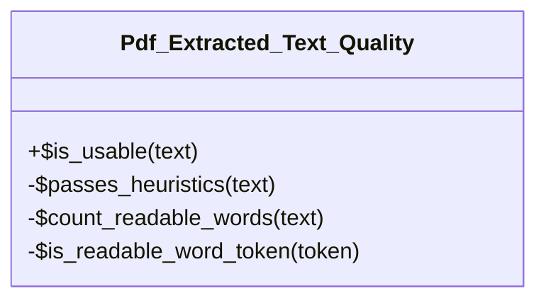

# Pdf_Extracted_Text_Quality

Basic quality gate for PDF text extracted via Smalot PdfParser.

Rejects non-empty but corrupted output so it is not stored in document_content_index.

***

* Full name: `\Tainacan\Pdf_Extracted_Text_Quality`

## Class Diagram



## Constants

| Constant                    | Visibility | Type | Value |
|-----------------------------|------------|------|-------|
| `MIN_LENGTH`                | public     |      | 100   |
| `MIN_LETTER_RATIO`          | public     |      | 0.38  |
| `MIN_READABLE_WORD_COUNT`   | public     |      | 12    |
| `MIN_READABLE_WORD_LETTERS` | public     |      | 2     |

## Methods

### is_usable

Whether extracted PDF text is usable for storage and search.

```php
public static is_usable(string $text): bool
```

* This method is **static**.
**Parameters:**

| Parameter | Type       | Description     |
|-----------|------------|-----------------|
| `$text`   | **string** | Extracted text. |

***

### passes_heuristics

```php
private static passes_heuristics(string $text): bool
```

* This method is **static**.
**Parameters:**

| Parameter | Type       | Description             |
|-----------|------------|-------------------------|
| `$text`   | **string** | Trimmed extracted text. |

***

### count_readable_words

```php
private static count_readable_words(string $text): int
```

* This method is **static**.
**Parameters:**

| Parameter | Type       | Description     |
|-----------|------------|-----------------|
| `$text`   | **string** | Extracted text. |

***

### is_readable_word_token

```php
private static is_readable_word_token(string $token): bool
```

* This method is **static**.
**Parameters:**

| Parameter | Type       | Description |
|-----------|------------|-------------|
| `$token`  | **string** | Word token. |

***
