# Logs

Repository for managing Tainacan logs.

Implements a comprehensive logging system for tracking changes
and operations within Tainacan including entity modifications.

***

* Full name: `\Tainacan\Repositories\Logs`
* Parent class: [`\Tainacan\Repositories\Repository`](./Repository)

## Class Diagram

```mermaid
classDiagram
    direction TB
    class Logs {
        +entities_type : mixed
        -current_diff : mixed
        -current_deleting_entity : mixed
        -current_action : mixed
        #init()
        #_get_map()
        +register_post_type()
        +fetch(args, _output)
        +fetch_count(args)
        -build_where(args)
        -normalize_date_bound(date, bound)
        -row_to_entity(row)
        +get_table_name()
        +insert(obj)
        +update(object, new_values)
        +fetch_last()
        +insert_attachment(post_ID)
        +pre_delete_attachment(attachment_id)
        +delete_attachment(attachment_id)
        +pre_insert_entity(unsaved)
        -prepare_item_metadata_diff(unsaved)
        +__temporary_multivalue_separator(sep)
        +insert_entity(entity)
        +pre_delete_entity(entity, permanent)
        +delete_entity(entity, permanent)
        -insert_item_metadata(entity)
        +filter_log_title(title)
        +tainacan_set_log_slug(override, slug, post_ID, post_status, post_type, post_parent)
    }
    class Repository {
        +entities_type : string
        #use_logs : bool
        #logs_repository : Logs
        -map : array
        +disable_logs()
        +enable_logs()
        +get_enabled_logs()
        #__construct()
        +init_objects()
        +get_map()
        +get_name()
        +insert(obj)
        +insert_metadata(obj, prop, diffs)
        +maybe_add_slashes(value)
        +fetch_output(WP_Query, output)
        +parse_fetch_args(args)
        +get_default_properties(map)
        +get_mapped_property(entity, prop)
        +$get_collections_db_identifiers()
        +$get_entity_by_post(post)
        +$get_entity_by_post_type(post_type, post)
        +$get_repository(entity)
        +fetch_one(args)
        +trash(entity)
        +delete(entity, permanent)
        -delete_attachments(entity)
        +can_edit(entity, user)
        +can_read(entity, user)
        +can_delete(entity, user)
        +can_publish(entity, user)
        +unique_multidimensional_array(array, key)
        -insert_thumbnail(obj, diffs)
        +get_descendants_ids(id, depth)
        +get_capabilities()
        #sanitize_value(content)
    }
    class Logs {
        +entities_type : mixed
        -current_diff : mixed
        -current_deleting_entity : mixed
        -current_action : mixed
        #init()
        #_get_map()
        +register_post_type()
        +fetch(args, output)
        +update(object, new_values)
        +fetch_last()
        +insert_attachment(post_ID)
        +pre_delete_attachment(attachment_id)
        +delete_attachment(attachment_id)
        +pre_insert_entity(unsaved)
        -prepare_item_metadata_diff(unsaved)
        +__temporary_multivalue_separator(sep)
        +insert_entity(entity)
        +pre_delete_entity(entity, permanent)
        +delete_entity(entity, permanent)
        -insert_item_metadata(entity)
        +filter_log_title(title)
        +tainacan_set_log_slug(override, slug, post_ID, post_status, post_type, post_parent)
    }
    Logs ..> Repository
    Repository ..> Logs
    Repository ..> Repository
    Repository <|-- Logs
```



## Properties

### entities_type

The entity type this repository manages.

```php
public string $entities_type
```

***

### current_diff

```php
private $current_diff
```

***

### current_deleting_entity

```php
private $current_deleting_entity
```

***

### current_action

```php
private $current_action
```

***

## Methods

### init

```php
protected init(): mixed
```

***

### _get_map

return properties map

```php
protected _get_map(): array
```

**Return Value:**

properties map array, format like:
  'id'             => [
    'map'        => 'ID',
    'title'       => __('ID', 'tainacan'),
    'type'       => 'integer',
    'description'=> __('Unique identifier', 'tainacan'),
    'validation' => v::numeric(),
],
'name'           =>  [
    'map'        => 'post_title',
    'title'       => __('Name', 'tainacan'),
    'type'       => 'string',
    'description'=> __('Name of the collection', 'tainacan'),
    'validation' => v::stringType(),
    'default'     => ''
],
'slug'           =>  [
    'map'        => 'post_name',
    'title'       => __('Slug', 'tainacan'),
    'type'       => 'string',
    'description'=> __('A unique and sanitized string representation of the collection, used to build the collection URL', 'tainacan'),
    'validation' => v::stringType(),
],

***

### register_post_type

```php
public register_post_type(): mixed
```

**See Also:**

* \Tainacan\Repositories\Repository::register_post_type()

***

### fetch

Fetch logs from the custom wp_tainacan_logs table.

```php
public fetch(array|int $args = [], mixed $_output = null): \Tainacan\Entities\Log|\Tainacan\Entities\Log[]
```

When an integer is passed, returns a single Log entity matching that ID,
or an empty array if not found.

When an array is passed, supports the following keys:

Filtering (WHERE):
  - int    $item_id       Filter by item ID.
  - int    $user_id       Filter by user ID.
  - string $collection_id Filter by collection ID (or 'default' for repository-level).
  - string $object_type   Filter by object type (fully-qualified class name).
  - string $object_id     Filter by object ID.
  - string $action        Filter by action key (e.g. 'create', 'update', 'delete').
  - string $s             Search term matched (case-insensitive LIKE) against
                          title, old_value, and new_value columns.
  - array  $date_query    Array of date clauses. Each clause may contain:
                            'after'     (string) – lower date bound (Y-m-d or Y-m-d H:i:s),
                            'before'    (string) – upper date bound,
                            'inclusive' (bool)   – whether bounds are inclusive (default false).

Ordering (ORDER BY):
  - string $orderby  Column to sort by. Allowed: ID, date, title, user_id,
                     collection_id, item_id, action. Defaults to 'ID'.
  - string $order    Sort direction: 'ASC' or 'DESC'. Defaults to 'DESC'.

Pagination (LIMIT / OFFSET):
  - int $posts_per_page  Number of rows to return. Use -1 for all. Defaults to -1.
  - int $paged           Page number (1-based), used with posts_per_page. Defaults to 1.
  - int $offset          Raw row offset, overrides paged when provided.

**Parameters:**

| Parameter  | Type           | Description                                            |
|------------|----------------|--------------------------------------------------------|
| `$args`    | **array\|int** | Associative array of query args, or an integer log ID. |
| `$_output` | **mixed**      |                                                        |

**Return Value:**

A single entity when $args is an ID,
or an array of entities when $args is an array.

***

### fetch_count

Count logs matching the given filters.

```php
public fetch_count(array $args = []): int
```

Accepts the same filtering args as fetch() (item_id, user_id,
collection_id, object_type, object_id, action) but ignores
pagination and ordering — it always returns an integer.

Typical pagination usage:
  $total      = $logs->fetch_count( $filters );
  $rows       = $logs->fetch( array_merge( $filters, [ 'posts_per_page' => 20, 'paged' => 2 ] ) );
  $total_pages = ceil( $total / 20 );

**Parameters:**

| Parameter | Type      | Description                               |
|-----------|-----------|-------------------------------------------|
| `$args`   | **array** | Same filtering keys supported by fetch(). |

**Return Value:**

Total number of matching rows.

***

### build_where

Build a parameterized WHERE clause from a filter args array.

```php
private build_where(array $args): array{0: string, 1: array}
```

Column names are taken from a whitelist, so they are never
interpolated from user input. Values are returned as a separate
$params array to be bound via $wpdb->prepare().

Supports an optional date_query key — an array of clause arrays, each
accepting: before (string), after (string), inclusive (bool|string).
Date-only values (Y-m-d) are automatically expanded to full datetimes.
Example:
  'date_query' => [ [ 'after' => '2026-04-09', 'before' => '2026-04-11', 'inclusive' => true ] ]

**Parameters:**

| Parameter | Type      | Description                                     |
|-----------|-----------|-------------------------------------------------|
| `$args`   | **array** | Filtering args (same keys accepted by fetch()). |

**Return Value:**

Tuple of [ $where_sql, $params ].
$where_sql is either an empty string or 'WHERE col = %%x AND …'.
$params holds the corresponding values in order.

***

### normalize_date_bound

Expands a date-only string (Y-m-d) to a full datetime for WHERE comparisons.

```php
private normalize_date_bound(string $date, string $bound): string
```

Datetime strings that already include a time component are returned as-is.

**Parameters:**

| Parameter | Type       | Description                                           |
|-----------|------------|-------------------------------------------------------|
| `$date`   | **string** | A date or datetime string.                            |
| `$bound`  | **string** | 'start' → appends 00:00:00, 'end' → appends 23:59:59. |

***

### row_to_entity

Build a Log entity from a custom table row.

```php
private row_to_entity(\stdClass $row): \Tainacan\Entities\Log
```

Fields that have setters are stored as class properties via
set_mapped_property(), so get_mapped_property() returns them
directly without hitting WP_Post or wp_postmeta.

Fields without setters (date, slug, id, status) are written
directly onto the entity's WP_Post stub so the inherited
get_mapped_property() fallback can still find them.

**Parameters:**

| Parameter | Type          | Description                                       |
|-----------|---------------|---------------------------------------------------|
| `$row`    | **\stdClass** | Row returned by $wpdb->get_row() / get_results(). |

***

### get_table_name

Returns the name of the custom logs table.

```php
public get_table_name(): string
```

***

### insert

Persist a Log entity into the custom wp_tainacan_logs table.

```php
public insert(\Tainacan\Entities\Log $obj): \Tainacan\Entities\Log|false
```

Uses $wpdb->insert() with explicit format specifiers so all values
go through wpdb's internal prepare(), preventing SQL injection.
Serializable fields (old_value, new_value) are passed through
maybe_serialize() before storage.

**Parameters:**

| Parameter | Type                       | Description |
|-----------|----------------------------|-------------|
| `$obj`    | **\Tainacan\Entities\Log** |             |

**Return Value:**

The entity with its new ID set, or false on failure.

**Throws:**

When the entity has not been validated before insert.
- [`Exception`](../../Exception)

***

### update

```php
public update(mixed $object, mixed $new_values = null): mixed
```

**Parameters:**

| Parameter     | Type      | Description |
|---------------|-----------|-------------|
| `$object`     | **mixed** |             |
| `$new_values` | **mixed** |             |

***

### fetch_last

Fetch most recent log.

```php
public fetch_last(): \Tainacan\Entities\Log|null
```

**Return Value:**

The most recent Log entity, or null if none exists.

***

### insert_attachment

Callback to generate log when attachments are added to any Tainacan entity

```php
public insert_attachment(mixed $post_ID): mixed
```

**Parameters:**

| Parameter  | Type      | Description |
|------------|-----------|-------------|
| `$post_ID` | **mixed** |             |

***

### pre_delete_attachment

Callback to generate log when attachments attached to any Tainacan entity are deleted

```php
public pre_delete_attachment(mixed $attachment_id): mixed
```

**Parameters:**

| Parameter        | Type      | Description |
|------------------|-----------|-------------|
| `$attachment_id` | **mixed** |             |

***

### delete_attachment

Callback to generate log when attachments attached to any Tainacan entity are deleted

```php
public delete_attachment(mixed $attachment_id): mixed
```

**Parameters:**

| Parameter        | Type      | Description |
|------------------|-----------|-------------|
| `$attachment_id` | **mixed** |             |

***

### pre_insert_entity

Compare two repository entities and sets the current_diff property to be used in the insert hook

```php
public pre_insert_entity(\Tainacan\Entities\Entity $unsaved): void
```

**Parameters:**

| Parameter  | Type                          | Description                              |
|------------|-------------------------------|------------------------------------------|
| `$unsaved` | **\Tainacan\Entities\Entity** | The new entity that is going to be saved |

***

### prepare_item_metadata_diff

```php
private prepare_item_metadata_diff(\Tainacan\Entities\Entity $unsaved): mixed
```

**Parameters:**

| Parameter  | Type                          | Description |
|------------|-------------------------------|-------------|
| `$unsaved` | **\Tainacan\Entities\Entity** |             |

***

### __temporary_multivalue_separator

```php
public __temporary_multivalue_separator(mixed $sep): mixed
```

**Parameters:**

| Parameter | Type      | Description |
|-----------|-----------|-------------|
| `$sep`    | **mixed** |             |

***

### insert_entity

Callback to generate log when Tainacan entities are edited

```php
public insert_entity(\Tainacan\Entities\Entity $entity): mixed
```

**Parameters:**

| Parameter | Type                          | Description |
|-----------|-------------------------------|-------------|
| `$entity` | **\Tainacan\Entities\Entity** |             |

***

### pre_delete_entity

```php
public pre_delete_entity(\Tainacan\Entities\Entity $entity, mixed $permanent): mixed
```

**Parameters:**

| Parameter    | Type                          | Description |
|--------------|-------------------------------|-------------|
| `$entity`    | **\Tainacan\Entities\Entity** |             |
| `$permanent` | **mixed**                     |             |

***

### delete_entity

```php
public delete_entity(\Tainacan\Entities\Entity $entity, mixed $permanent): mixed
```

**Parameters:**

| Parameter    | Type                          | Description |
|--------------|-------------------------------|-------------|
| `$entity`    | **\Tainacan\Entities\Entity** |             |
| `$permanent` | **mixed**                     |             |

***

### insert_item_metadata

```php
private insert_item_metadata(\Tainacan\Entities\Item_Metadata_Entity $entity): mixed
```

**Parameters:**

| Parameter | Type                                        | Description |
|-----------|---------------------------------------------|-------------|
| `$entity` | **\Tainacan\Entities\Item_Metadata_Entity** |             |

***

### filter_log_title

```php
public filter_log_title(mixed $title): mixed
```

**Parameters:**

| Parameter | Type      | Description |
|-----------|-----------|-------------|
| `$title`  | **mixed** |             |

***

### tainacan_set_log_slug

```php
public tainacan_set_log_slug(mixed $override, mixed $slug, mixed $post_ID, mixed $post_status, mixed $post_type, mixed $post_parent): mixed
```

**Parameters:**

| Parameter      | Type      | Description |
|----------------|-----------|-------------|
| `$override`    | **mixed** |             |
| `$slug`        | **mixed** |             |
| `$post_ID`     | **mixed** |             |
| `$post_status` | **mixed** |             |
| `$post_type`   | **mixed** |             |
| `$post_parent` | **mixed** |             |

***

## Inherited methods

### disable_logs

Disables creation of logs while inserting and updating entities.

```php
public disable_logs(): void
```

***

### enable_logs

Enables creation of logs while inserting and updating entities.

```php
public enable_logs(): void
```

***

### get_enabled_logs

Gets whether creation of logs while inserting and updating entities is enabled.

```php
public get_enabled_logs(): bool
```

**Return Value:**

True if logging is enabled, false otherwise.

***

### __construct

```php
private __construct(): mixed
```

***

### init_objects

```php
public init_objects(): mixed
```

***

### _get_map

return properties map

```php
protected _get_map(): array
```

* This method is **abstract**.
**Return Value:**

properties map array, format like:
  'id'             => [
    'map'        => 'ID',
    'title'       => __('ID', 'tainacan'),
    'type'       => 'integer',
    'description'=> __('Unique identifier', 'tainacan'),
    'validation' => v::numeric(),
],
'name'           =>  [
    'map'        => 'post_title',
    'title'       => __('Name', 'tainacan'),
    'type'       => 'string',
    'description'=> __('Name of the collection', 'tainacan'),
    'validation' => v::stringType(),
    'default'     => ''
],
'slug'           =>  [
    'map'        => 'post_name',
    'title'       => __('Slug', 'tainacan'),
    'type'       => 'string',
    'description'=> __('A unique and sanitized string representation of the collection, used to build the collection URL', 'tainacan'),
    'validation' => v::stringType(),
],

***

### get_map

```php
public get_map(): mixed
```

***

### get_name

Return repository name

```php
public get_name(): string
```

**Return Value:**

The repository name

***

### insert

```php
public insert(\Tainacan\Entities\Entity $obj): \Tainacan\Entities\Entity|bool
```

**Parameters:**

| Parameter | Type                          | Description |
|-----------|-------------------------------|-------------|
| `$obj`    | **\Tainacan\Entities\Entity** |             |

**Throws:**

- [`Exception`](../../Exception)

***

### insert_metadata

Insert object property stored as postmeta into the database

```php
public insert_metadata(\Tainacan\Entities $obj, string $prop, mixed $diffs): null|false
```

**Parameters:**

| Parameter | Type                   | Description                                                 |
|-----------|------------------------|-------------------------------------------------------------|
| `$obj`    | **\Tainacan\Entities** | The entity object                                           |
| `$prop`   | **string**             | the property name, as declared in the map of the repository |
| `$diffs`  | **mixed**              |                                                             |

**Return Value:**

on error

***

### maybe_add_slashes

```php
public maybe_add_slashes(mixed $value): mixed
```

**Parameters:**

| Parameter | Type      | Description |
|-----------|-----------|-------------|
| `$value`  | **mixed** |             |

***

### fetch_output

Prepare the output for the fetch() methods.

```php
public fetch_output(\WP_Query $WP_Query, string $output = 'WP_Query'): array|\WP_Query
```

Possible outputs are:
WP_Query (default) - returns the WP_Object itself
OBJECT - return an Array of Tainacan\Entities

**Parameters:**

| Parameter   | Type          | Description                                                                           |
|-------------|---------------|---------------------------------------------------------------------------------------|
| `$WP_Query` | **\WP_Query** |                                                                                       |
| `$output`   | **string**    | `WP_Query` for a single WP_Query object or `OBJECT` for an array of Tainacan\Entities |

***

### parse_fetch_args

Maps repository mapped properties to WP_Query arguments.

```php
public parse_fetch_args(array $args = []): array
```

This allows to build fetch arguments using both WP_Query arguments
and the mapped properties for the repository.

For example, you can use any of the following methods to browse collections by name:
$TainacanCollections->fetch(['title' => 'test']);
$TainacanCollections->fetch(['name' => 'test']);

The property `name` is transformed into the native WordPress property `post_title`. (actually only title for query purpouses)

Example 2, this also works with properties mapped to postmeta. The following methods are the same:
$TainacanMetadatas->fetch(['required' => 'yes']);
$TainacanMetadatas->fetch(['meta_query' => [
    [
        'key' => 'required',
        'value' => 'yes'
    ]
]]);

**Parameters:**

| Parameter | Type      | Description   |
|-----------|-----------|---------------|
| `$args`   | **array** | [description] |

**Return Value:**

$args new $args array with mapped properties

***

### get_default_properties

Return default properties

```php
public get_default_properties(array $map): array
```

**Parameters:**

| Parameter | Type      | Description |
|-----------|-----------|-------------|
| `$map`    | **array** |             |

***

### get_mapped_property

return the value for a mapped property from database

```php
public get_mapped_property(\Tainacan\Entities\Entity $entity, string $prop): mixed
```

**Parameters:**

| Parameter | Type                          | Description    |
|-----------|-------------------------------|----------------|
| `$entity` | **\Tainacan\Entities\Entity** |                |
| `$prop`   | **string**                    | id of property |

**Return Value:**

property value

***

### get_collections_db_identifiers

Return array of collections db identifiers

```php
public static get_collections_db_identifiers(): array[]
```

* This method is **static**.
***

### get_entity_by_post

```php
public static get_entity_by_post(int|\WP_Post $post): \Tainacan\Entities\Entity|bool
```

* This method is **static**.
**Parameters:**

| Parameter | Type              | Description |
|-----------|-------------------|-------------|
| `$post`   | **int\|\WP_Post** | \|Entity    |

**Throws:**

- [`Exception`](../../Exception)

***

### get_entity_by_post_type

```php
public static get_entity_by_post_type(string $post_type, int|\WP_Post $post = 0): \Tainacan\Entities\Entity|bool
```

* This method is **static**.
**Parameters:**

| Parameter    | Type              | Description                                                    |
|--------------|-------------------|----------------------------------------------------------------|
| `$post_type` | **string**        |                                                                |
| `$post`      | **int\|\WP_Post** | optional post ID or WordPress post data for creation of Entity |

**Return Value:**

the entity for post_type, with data if $post is given or false

**Throws:**

- [`Exception`](../../Exception)

***

### get_repository

Return Entity's Repository

```php
public static get_repository(\Tainacan\Entities\Entity $entity): \Tainacan\Repositories\Repository|bool
```

* This method is **static**.
**Parameters:**

| Parameter | Type                          | Description |
|-----------|-------------------------------|-------------|
| `$entity` | **\Tainacan\Entities\Entity** |             |

**Return Value:**

return the entity Repository or false

***

### fetch_one

Fetch one Entity based on query args.

```php
public fetch_one(array $args): false|\Tainacan\Entities
```

Note: Does not work with Item_Metadata Repository

**Parameters:**

| Parameter | Type      | Description                     |
|-----------|-----------|---------------------------------|
| `$args`   | **array** | Query Args as expected by fetch |

**Return Value:**

The entity or false if none was found

***

### trash

Shortcut to delete($entity, false)

```php
public trash(\Tainacan\Entities\Entity $entity): mixed|\Tainacan\Entities\Entity
```

**Parameters:**

| Parameter | Type                          | Description |
|-----------|-------------------------------|-------------|
| `$entity` | **\Tainacan\Entities\Entity** |             |

**Return Value:**

@see https://developer.wordpress.org/reference/functions/wp_delete_post/

***

### delete

```php
public delete(\Tainacan\Entities\Entity $entity, bool $permanent = true): mixed|\Tainacan\Entities\Entity
```

**Parameters:**

| Parameter    | Type                          | Description                                                         |
|--------------|-------------------------------|---------------------------------------------------------------------|
| `$entity`    | **\Tainacan\Entities\Entity** |                                                                     |
| `$permanent` | **bool**                      | If false, sendo to trash, if true, permanently delete. Default true |

**Return Value:**

@see https://developer.wordpress.org/reference/functions/wp_delete_post/

***

### fetch

```php
public fetch(mixed $args, mixed $output = null): mixed
```

* This method is **abstract**.
**Parameters:**

| Parameter | Type      | Description |
|-----------|-----------|-------------|
| `$args`   | **mixed** |             |
| `$output` | **mixed** |             |

***

### update

```php
public update(mixed $object, mixed $new_values = null): mixed
```

* This method is **abstract**.
**Parameters:**

| Parameter     | Type      | Description |
|---------------|-----------|-------------|
| `$object`     | **mixed** |             |
| `$new_values` | **mixed** |             |

***

### register_post_type

```php
public register_post_type(): mixed
```

* This method is **abstract**.
***

### can_edit

Check if $user can edit/create a entity

```php
public can_edit(\Tainacan\Entities\Entity $entity, int|\WP_User|null $user = null): bool
```

**Parameters:**

| Parameter | Type                          | Description                          |
|-----------|-------------------------------|--------------------------------------|
| `$entity` | **\Tainacan\Entities\Entity** |                                      |
| `$user`   | **int\|\WP_User\|null**       | default is null for the current user |

**Throws:**

- [`Exception`](../../Exception)

***

### can_read

Check if $user can read the entity

```php
public can_read(\Tainacan\Entities\Entity $entity, int|\WP_User|null $user = null): bool
```

**Parameters:**

| Parameter | Type                          | Description                          |
|-----------|-------------------------------|--------------------------------------|
| `$entity` | **\Tainacan\Entities\Entity** |                                      |
| `$user`   | **int\|\WP_User\|null**       | default is null for the current user |

**Throws:**

- [`Exception`](../../Exception)

***

### can_delete

Check if $user can delete the entity

```php
public can_delete(\Tainacan\Entities\Entity $entity, int|\WP_User|null $user = null): bool
```

**Parameters:**

| Parameter | Type                          | Description                          |
|-----------|-------------------------------|--------------------------------------|
| `$entity` | **\Tainacan\Entities\Entity** |                                      |
| `$user`   | **int\|\WP_User\|null**       | default is null for the current user |

**Throws:**

- [`Exception`](../../Exception)

***

### can_publish

Check if $user can publish entity

```php
public can_publish(\Tainacan\Entities\Entity $entity, int|\WP_User|null $user = null): bool
```

**Parameters:**

| Parameter | Type                          | Description                          |
|-----------|-------------------------------|--------------------------------------|
| `$entity` | **\Tainacan\Entities\Entity** |                                      |
| `$user`   | **int\|\WP_User\|null**       | default is null for the current user |

**Throws:**

- [`Exception`](../../Exception)

***

### unique_multidimensional_array

Removes duplicates from multidimensional array

```php
public unique_multidimensional_array(mixed $array, mixed $key): array
```

**Parameters:**

| Parameter | Type      | Description |
|-----------|-----------|-------------|
| `$array`  | **mixed** |             |
| `$key`    | **mixed** |             |

***

### get_descendants_ids

Get IDs for all children, grand children till the depth parameter is reached

```php
public get_descendants_ids(int|\Tainacan\Entities\Entity $id, bool|int $depth = false): array
```

**Parameters:**

| Parameter | Type                               | Description                                                            |
|-----------|------------------------------------|------------------------------------------------------------------------|
| `$id`     | **int\|\Tainacan\Entities\Entity** | The Entity ID or object                                                |
| `$depth`  | **bool\|int**                      | The maximum depth to llok for descendants. default is false = no limit |

**Return Value:**

Array of IDs

***

### get_capabilities

Get the capabilities list for the post type of the entity

```php
public get_capabilities(): object
```

**Return Value:**

Object with all the capabilities as member variables.

***

### sanitize_value

```php
protected sanitize_value(mixed $content): mixed
```

**Parameters:**

| Parameter  | Type      | Description |
|------------|-----------|-------------|
| `$content` | **mixed** |             |

***

### get_instance

```php
public static get_instance(): mixed
```

* This method is **static**.
***
