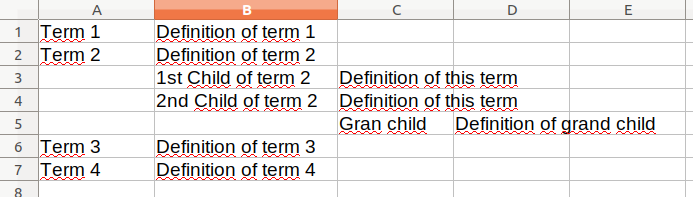

# Vocabulary Importer

This importer allows user to add terms to a given taxonomy. It's useful to import controlled vocabularies to a Tainacan installation.

The file format used to import vocabularies is a CSV - comma separated values. Each line of the file will represent one term.

For each term, you can inform the name of the term and it's definition.

For example:

```
Term 1,Definition of term 1
Term 2,Definition of term 2
Term 3,Definition of term 3
```

It's also possible to inform hierarchy. You do so by leaving empty cells to the left, indicating the level in the hierarchy the term is in.

Your spreadsheet will look like this:



This same spreadsheet, saved in CSV format, will look like this:

```
Term 1,Definition of term 1,,
Term 2,Definition of term 2,,
,1st Child of term 2,Definition of this term,
,2nd Child of term 2,Definition of this term,
,,Gran child,Definition of grand child
Term 3,Definition of term 3,,
Term 4,Definition of term 4,,
```

Once you have your CSV ready, fire the Vocabulary CSV Importer, choose the target Taxonomy (or create one), and hit "Run".